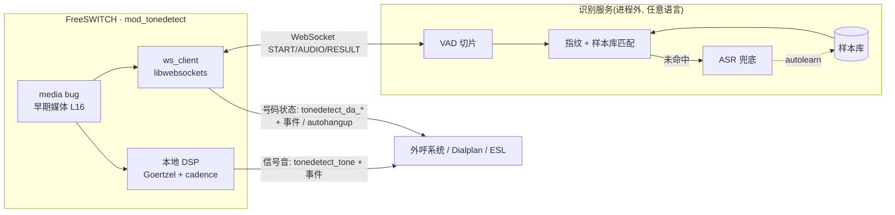
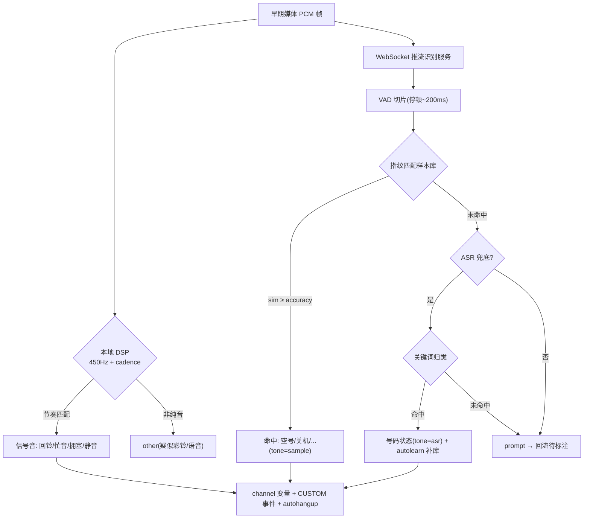
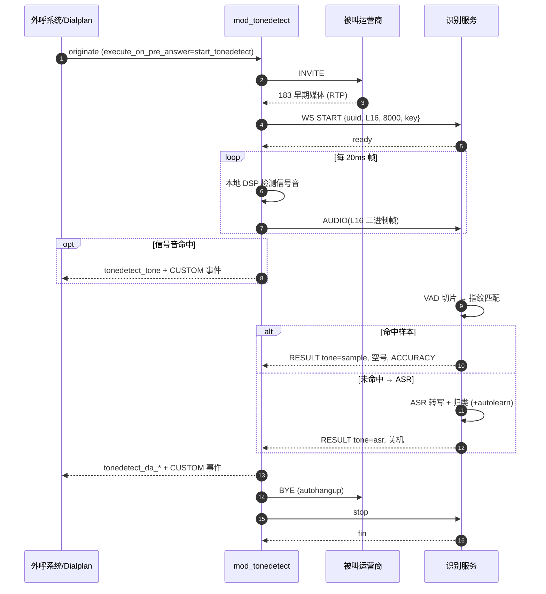

# mod_tonedetect — FreeSWITCH 回铃音/号码状态检测

通过分析早期媒体(early media)的声音,检测呼叫接续过程中的信号音类型与被叫号码状态,用于自动外呼系统快速判断呼叫结果(回铃/忙音/拥塞/空号/关机等),无需等待对端 60s 超时挂断,从而节省线路资源、提高外呼速度与坐席接通率。

能力对标顶顶通 `mod_da2`,采用**本地 mod + 独立识别服务**的分层架构,分阶段自研实现。

---

## 一、技术方案

### 1.1 整体架构图



设计原则:**FreeSWITCH 模块只做"媒体采集 + 结果回填 + 挂机控制",重计算放进程外的识别服务**,便于独立扩缩容、算法迭代与私有化部署。信号音(回铃/忙音/拥塞/450hz/静音)由本地 DSP 直接判定;语音提示音(空号/关机/停机/语音信箱)转发识别服务。

### 1.2 识别决策交互图



### 1.3 呼叫检测时序图



> 完整的 WebSocket 协议、消息字段、第三方服务实现指南与 FreeSWITCH 侧对接细节,见 **[`docs/INTEGRATION.md`](./docs/INTEGRATION.md)**。

### 1.4 分阶段路线

| 阶段 | 范围 | 识别手段 | 状态 |
|---|---|---|---|
| **阶段 1** | 国内 450Hz 信号音:回铃/忙音/拥塞/450hz/静音 + other(疑似彩铃/语音粗分) | 本地 DSP(Goertzel + cadence) | ✅ 已实现 |
| **阶段 2** | 语音提示音:空号/关机/停机/通话中/语音信箱等 | 独立 Python 服务([`server/`](./server)) + VAD 切片 + **音频指纹/样本库匹配** | ✅ 已实现 |
| **阶段 3** | 样本库未命中的兜底与泛化 | **ASR 转写 + 关键词匹配**,ASR 归类的段自动回流补库(热重载) | ✅ 已实现 |

> 选型依据:语音提示音识别以**音频指纹/样本库匹配**为主(快、省 CPU、加样本即扩展),ASR 仅作兜底。彩铃/真人等"非纯音"先由 DSP 粗分为 `other`,交识别服务细分。

### 1.5 阶段 1 — 信号音 DSP 算法

与 FreeSWITCH 解耦,实现于 `src/tone_dsp.{h,c}`,可离线单测。

**处理流水线**

```
PCM 16bit mono → 20ms 分析块 → 每块标签{TONE_450 | SILENCE | OTHER} → cadence 状态机 → 信号音分类
```

1. **分块**:按 `block_ms`(默认 20ms = 8k 下 160 样本)切块。
2. **Goertzel 单频检测**:在 450Hz 对应 DFT bin 上算能量,得到"纯音占比"`purity = 2*goertzel_power / (N*energy)`(纯音≈1,语音/噪声偏小);结合 RMS 静音门限,给每块打标签:
   - `SILENCE`:RMS < `silence_rms`
   - `TONE`:`purity ≥ purity_threshold`(450Hz 主导)
   - `OTHER`:有能量但非 450 主导(彩铃/语音候选)
3. **cadence 节奏状态机**:跟踪 ON(TONE)/OFF(SILENCE)段的时长,按规则匹配:
   - 命中级联结果(busy/congestion/ringback)后"粘性"保持,不被裸 450hz 降级
   - 回铃 OFF 长达 ~4s,silence 超过 `ring_early_off_ms`(默认 2s)即**提前判定回铃**,加快速度
   - 持续 OTHER ≥ `min_other_ms` 上报 `other`;静默起始持续 ≥ `silence_min_ms` 上报 `silence`

**国内 450Hz 节奏标准(默认,可配置容差)**

| 信号音 | ON | OFF |
|---|---|---|
| 回铃音 ringback | ~1000ms | ~4000ms |
| 忙音 busy | ~350ms | ~350ms |
| 拥塞/快忙 congestion | ~700ms | ~700ms |

---

## 二、对接方式

完整对接文档已独立成文,便于其他 WebSocket 服务/外呼系统快速对接:**[`docs/INTEGRATION.md`](./docs/INTEGRATION.md)**。内容包括:

- WebSocket 协议 v1(`START`/`AUDIO`/`RESULT`/`STOP`/`FIN`)的完整字段表与示例
- 自建/替换识别服务的**最小行为契约**、兼容性检查清单与最小示例(wscat / Python)
- FreeSWITCH 侧对接:`originate`/dialplan 启动、可覆盖的 channel 变量、结果读取(channel 变量 + CUSTOM 事件)、号码状态对照表、SIP 挂机码(规划)

快速上手(收到 183 早期媒体时启动检测):

```
originate {ignore_early_media=consume,execute_on_pre_answer=start_tonedetect}sofia/gateway/NUMBER &park
```

结果落在 channel 变量 `tonedetect_tone`(信号音)、`tonedetect_da_category`/`tonedetect_da_alias`(号码状态),并以 `CUSTOM tonedetect` 事件实时抛出。

---

## 三、目录结构

| 路径 | 说明 |
|---|---|
| `src/tone_dsp.{h,c}` | 与 FreeSWITCH 解耦的 DSP 核心:Goertzel + cadence 状态机 |
| `src/ws_client.{h,c}` | 与 FreeSWITCH 解耦的 libwebsockets 客户端:把 L16 音频流式推给识别服务 |
| `server/` | 阶段2/3 独立 Python 识别服务(WebSocket + VAD + 音频指纹/样本库 + ASR 兜底),见 `server/README.md` |
| `docs/INTEGRATION.md` | 对接文档:WebSocket 协议、第三方服务实现指南、FreeSWITCH 侧对接(含架构/时序图) |
| `module/mod_tonedetect.c` | FreeSWITCH 模块:media bug 抓早期媒体 → 本地 DSP + 经 WebSocket 推流识别服务 → channel 变量 / CUSTOM 事件 / autohangup |
| `module/tonedetect.conf.xml` | 模块配置(stoptone / autohangup / maxdetecttime / 节奏规则) |
| `module/Makefile` | 针对已安装的 FreeSWITCH 构建 `mod_tonedetect.so` |
| `test/` | 离线测试:WAV 读写、合成音生成器、检测器测试程序 |
| `Makefile` | 离线构建并运行 DSP 检测测试(无需 FreeSWITCH) |

---

## 四、构建与测试

### 4.1 离线测试 DSP 核心(无需 FreeSWITCH)

```bash
make test
```

生成合成的 回铃/忙音/拥塞/静音/other/级联 场景 WAV,并断言检测器输出正确。

### 4.2 构建并安装 FreeSWITCH 模块

需已安装 FreeSWITCH 及其开发头文件(`libfreeswitch-dev` 或源码)。

```bash
cd module
make FS_INCLUDE=/usr/include/freeswitch FS_MODDIR=/usr/lib/freeswitch/mod
sudo make install
```

将 `tonedetect.conf.xml` 放入 `autoload_configs/`,并在 `modules.conf.xml` 中加载 `mod_tonedetect`。

### 4.3 配置项(`tonedetect.conf.xml`)

| 参数 | 说明 |
|---|---|
| `stoptone` | 命中即停止的信号音(可被 `tonedetect_stoptone` 覆盖) |
| `autohangup` | 命中 stoptone 是否自动挂机(可被 `tonedetect_autohangup` 覆盖) |
| `maxdetecttime` | 最大检测秒数(可被 `tonedetect_maxdetecttime` 覆盖) |
| `purity_threshold` | 450Hz 纯音占比阈值(0..1) |
| `silence_rms` | 静音 RMS 门限(满量程 32768) |
| `tone_busy_rule` / `tone_congestion_rule` / `tone_ringback_rule` | 节奏规则 `on_min-on_max\|off_min-off_max`(毫秒) |
