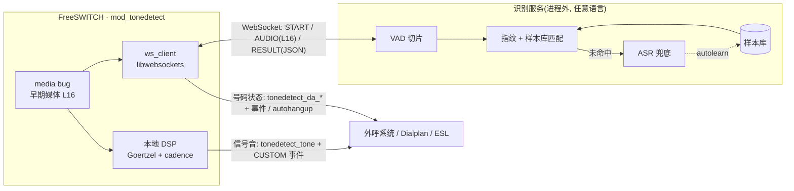
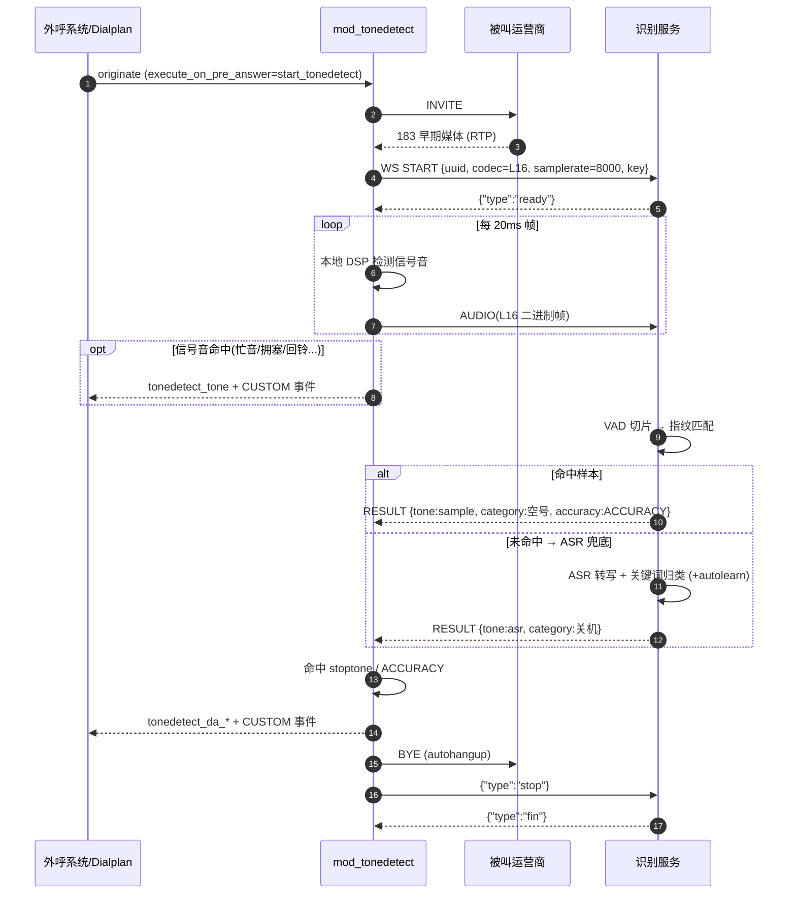

# mod_tonedetect 对接文档(WebSocket 集成指南)

本文是 `mod_tonedetect` 的**对接契约**,面向两类集成方:

1. **自建/替换识别服务**:用任意语言实现一个与 `mod_tonedetect` 兼容的 WebSocket 服务(替代本仓库的 Python 服务)。只要遵守第 3 节协议即可对接。
2. **驱动检测并取结果**:从 FreeSWITCH 侧(外呼系统 / Dialplan / ESL)启动检测并读取号码状态(第 5 节)。

> 协议版本:**v1**。音频规格:**L16 / 8kHz / 单声道 / 小端 16-bit PCM**,建议 20ms 一帧(160 样本 / 320 字节)。

---

## 1. 角色与数据流



**职责边界**:FreeSWITCH 侧只做"媒体采集 + 结果回填 + 挂机控制";识别(VAD/指纹/ASR/样本库)全部在进程外的 WebSocket 服务里完成,可用任意语言实现并独立扩缩容。

---

## 2. 时序图(一次外呼检测)



---

## 3. WebSocket 协议(v1)

实时流式长连接,每条 call leg 一条 WebSocket。**音频上行用二进制帧,控制/结果用文本帧(JSON)**。

### 3.1 连接

- URL:`ws://host:port/`(内网)或 `wss://host:port/`(公网)
- 子协议:无强制要求
- 低延迟:`TCP_NODELAY` 关 Nagle、逐帧 flush

### 3.2 START(client → server,文本/JSON)

连接后客户端的**第一条**消息,声明媒体参数并鉴权。

```json
{
  "type": "start",
  "version": 1,
  "uuid": "<freeswitch-channel-uuid>",
  "codec": "L16",
  "samplerate": 8000,
  "key": "<auth-key>",
  "params": { "stoptone": "busy silence", "maxdetecttime": 60 }
}
```

| 字段 | 类型 | 说明 |
|---|---|---|
| `type` | string | 固定 `"start"` |
| `version` | int | 协议版本,当前 `1` |
| `uuid` | string | FreeSWITCH 通道 uuid(便于服务端日志/回流命名) |
| `codec` | string | 固定 `"L16"` |
| `samplerate` | int | 采样率,通常 `8000` |
| `key` | string | 鉴权 key(可空) |
| `params` | object | 可选,透传检测参数 |

服务端校验通过回 `ready`,否则回 `error` 并关闭:

```json
{ "type": "ready" }
{ "type": "error", "reason": "bad_key" }
```

### 3.3 AUDIO(client → server,二进制)

START 之后的所有**二进制帧**均为原始小端 16-bit PCM(单声道,采样率同 START)。建议 20ms 一帧。

### 3.4 RESULT(server → client,文本/JSON)

服务端做 VAD 切片,每识别出一个语音段推送一条结果(一连接可多次)。

```json
{
  "type": "result",
  "tone": "sample",
  "category": "空号",
  "alias": "does not exist",
  "name": "konghao_yidong",
  "accuracy": "ACCURACY",
  "score": 0.93,
  "point_begin": 1200,
  "point_end": 2600
}
```

| 字段 | 类型 | 说明 |
|---|---|---|
| `type` | string | 固定 `"result"` |
| `tone` | string | `sample`(命中样本库) / `asr`(ASR 兜底归类) / `prompt`(有语音未识别) / `silence` |
| `accuracy` | string | `ACCURACY` / `INACCURACY` / `LOOSE` —— **仅 `ACCURACY` 应触发上报/挂机** |
| `score` | number | 与最佳样本的相似度 0..1(指纹路径) |
| `category` | string | 号码状态中文类别(见下表),`sample`/`asr` 时给出 |
| `alias` | string | 号码状态英文别名(见下表) |
| `name` | string | 命中的样本名(仅 `tone=sample`) |
| `text` | string | ASR 转写文本(仅 `tone=asr`) |
| `point_begin`/`point_end` | int | 语音段在流中的毫秒位置 |

### 3.5 STOP / FIN

- 客户端结束:`{"type":"stop"}`(或直接关闭连接)
- 服务端在关闭前可发:`{"type":"fin"}`

### 3.6 错误码(`error.reason`)

| reason | 含义 |
|---|---|
| `bad_key` | 鉴权失败 |
| `bad_json` | START/控制帧 JSON 非法 |
| `limit` | 并发超限,客户端应优雅降级 |

### 3.7 号码状态对照表(完整,id 2-20)

标准表的单一来源为 `server/tonedetect_server/states.py`,`sampletool states` 可随时打印。

| id | category | alias | 说明 |
|---|---|---|---|
| 2 | 关机 | power off | 关机 |
| 3 | 空号 | does not exist | 空号 |
| 4 | 停机 | out of service | 停机 |
| 5 | 正在通话中 | hold on | 通话中(多数交换机拒接/无应答也返回此) |
| 6 | 用户拒接 | not convenient | 用户拒接 |
| 7 | 无法接通 | is not reachable | 无法接通 |
| 8 | 暂停服务 | not in service | 暂停服务 |
| 9 | 用户正忙 | busy now | 用户正忙 |
| 10 | 拨号方式不正确 | not a local number | 拨号方式不正确 |
| 11 | 呼入限制 | barring of incoming | 呼入限制 |
| 12 | 来电提醒 | call reminder | 秘书服务/来电提醒/语音信箱/留言 |
| 13 | 呼叫转移失败 | forwarded | 呼叫转移失败 |
| 14 | 网络忙 | line is busy | 网络忙 |
| 15 | 无人接听 | not answer | 无人接听 |
| 16 | 欠费 | defaulting | 欠费 |
| 17 | 无法接听 | cannot be connected | 无法接听 |
| 18 | 改号 | number change | 改号 |
| 19 | 线路故障 | line fault | 线路不能呼出(如 SIM 卡欠费) |
| 20 | 稍后再拨 | redial later | 各种稍后再拨提示 |

信号音(本地 DSP / 服务粗分):`ringback`/`busy`/`congestion`/`colorringback`(彩铃)/`450hz`/`silence`/`other`。

> `RESULT` 命中状态时附带 `id` 字段(上表),便于上游按数字映射 SIP 挂机码。识别准确率的提升方法见 [`ACCURACY.md`](./ACCURACY.md)。

---

## 4. 自建识别服务实现指南(第三方)

实现一个兼容服务,只需满足以下**最小行为契约**:

1. 接受 WebSocket 连接。
2. 等待第一条文本帧 `START`;校验 `key`(若启用),回 `{"type":"ready"}`,失败回 `{"type":"error","reason":"bad_key"}` 并关闭。
3. 之后把收到的**二进制帧**当作连续 L16 PCM 累积(采样率取自 START)。
4. 自行做 VAD / 识别(指纹、ASR、或你已有的引擎)。
5. 每得到一个结论,推送一条 `RESULT` 文本帧;**只有把握高时才用 `accuracy:"ACCURACY"`**(它会触发 mod 上报/挂机)。
6. 收到 `{"type":"stop"}` 或连接关闭时停止;可回 `{"type":"fin"}`。

### 4.1 兼容性检查清单

- [ ] 第一帧必须能解析 `START` 并回 `ready`
- [ ] 二进制帧按小端 int16、单声道、START 的 `samplerate` 解释
- [ ] `RESULT.tone` 取值在 `{sample, asr, prompt, silence}` 内
- [ ] `RESULT.accuracy` 仅在确信时为 `ACCURACY`
- [ ] 大消息不截断(WebSocket `max_size` 放开或音频分帧)
- [ ] 连接可被客户端随时关闭,服务端不崩

### 4.2 最小示例

命令行快速验证(发 START 后,需要再发二进制音频,这里只演示握手):

```bash
# 安装 wscat: npm i -g wscat
wscat -c ws://127.0.0.1:9977/
> {"type":"start","version":1,"uuid":"t","codec":"L16","samplerate":8000}
< {"type":"ready"}
```

Python(asyncio + websockets)最小服务端骨架:

```python
import asyncio, json, websockets

async def handler(ws):
    started = False
    async for msg in ws:
        if isinstance(msg, str):
            m = json.loads(msg)
            if m.get("type") == "start":
                started = True
                await ws.send(json.dumps({"type": "ready"}))
            elif m.get("type") == "stop":
                break
        elif started:
            pcm = memoryview(msg).cast("h")   # 小端 int16
            # TODO: 累积/VAD/识别, 命中后:
            # await ws.send(json.dumps({"type":"result","tone":"sample",
            #   "category":"空号","alias":"does not exist","accuracy":"ACCURACY",
            #   "point_begin":0,"point_end":0}))
    await ws.send(json.dumps({"type": "fin"}))

async def main():
    async with websockets.serve(handler, "0.0.0.0", 9977, max_size=None):
        await asyncio.Future()

asyncio.run(main())
```

> 本仓库 `server/` 即一个完整参考实现(VAD + 音频指纹 + 样本库 + ASR 兜底),可直接用或作为对照。

---

## 5. FreeSWITCH 侧对接

### 5.1 启动检测

收到 183 早期媒体时启动(`execute_on_pre_answer`);模拟线路无 183 直接应答的用 `execute_on_media`。

```
originate {ignore_early_media=consume,execute_on_pre_answer=start_tonedetect}sofia/gateway/NUMBER &park
```

- `ignore_early_media=consume`:原拨号串若为 `ignore_early_media=true` 需改为 `consume`,否则收不到/不消费早期媒体。
- FS 无公网 IP / RTP 未映射时,需先发媒体流才能收到早期媒体:
  `execute_on_pre_answer_sendrtp=playback::silence_stream://1000`。

Dialplan:

```xml
<extension name="tonedetect">
  <condition field="destination_number" expression="^(\d+)$">
    <action application="export" data="nolocal:execute_on_pre_answer=start_tonedetect"/>
    <action application="bridge" data="sofia/gateway/${1}"/>
  </condition>
</extension>
```

手动停止:`stop_tonedetect`。

### 5.2 每通可覆盖的 channel 变量(呼叫前 set/export)

| 变量 | 说明 |
|---|---|
| `tonedetect_stoptone` | 命中即停止的信号音:`busy ringback congestion 450hz silence other`(或 `all`) |
| `tonedetect_autohangup` | `true`/`false`,命中即自动挂机 |
| `tonedetect_maxdetecttime` | 最大检测秒数 |
| `tonedetect_record_path` | 早期媒体录音目录(样本采集用) |

### 5.3 结果读取 —— channel 变量

在 `CHANNEL_HANGUP_COMPLETE` 等事件读取(ESL 中前缀 `variable_`):

| 变量 | 来源 | 说明 |
|---|---|---|
| `tonedetect_tone` | 本地 DSP | 信号音:`ringback`/`busy`/`congestion`/`450hz`/`silence`/`other` |
| `tonedetect_finish_cause` | mod | 停止原因:`stoptone`/`timeout`/`sample`/`stop` |
| `tonedetect_da_tone` | 识别服务 | `sample`/`asr`/`prompt` |
| `tonedetect_da_category` | 识别服务 | 号码状态类别(空号/关机…) |
| `tonedetect_da_alias` | 识别服务 | 号码状态英文别名 |
| `tonedetect_da_accuracy` | 识别服务 | `ACCURACY`/`INACCURACY`/`LOOSE` |

### 5.4 结果读取 —— CUSTOM 事件(实时)

订阅 `Event-Subclass: tonedetect`(`Event-Name: CUSTOM`):

```
/event CUSTOM tonedetect          # fs_cli
```

| 头 | 说明 |
|---|---|
| `tonedetect_tone` | 本地 DSP 信号音类型 |
| `tonedetect_begin_ms`/`tonedetect_end_ms` | 证据时间(流相对毫秒) |
| `tonedetect_source` | `server` 表示来自识别服务 |
| `tonedetect_da_tone`/`tonedetect_da_category`/`tonedetect_da_alias`/`tonedetect_da_accuracy` | 识别服务结果 |

ESL 订阅:`CHANNEL_HANGUP_COMPLETE CUSTOM tonedetect`。

### 5.5 SIP 挂机码反馈(规划)

参考 `mod_da2`,可把号码状态映射为自定义 SIP 挂断码(如 空号→433、关机→432、停机→434…),让上游通过挂机码即可获知结果,实现 `VOS → 检测系统 → VOS` 的纯 SIP 对接。
