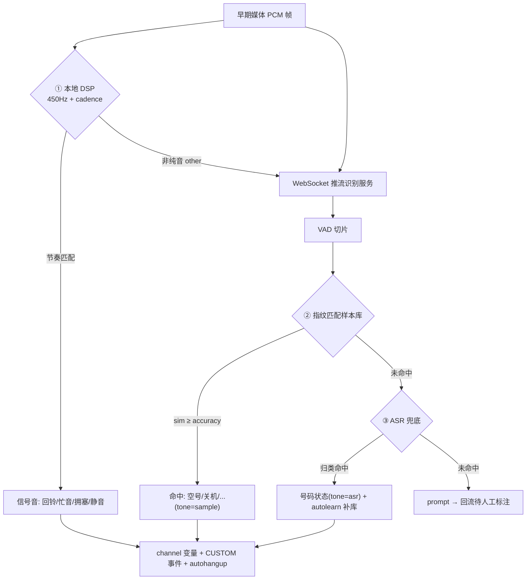

# 回铃音检测 — 技术方案沟通

> 本文用于回铃音检测项目的技术方案对齐与沟通,梳理"是什么、为什么、怎么做、本期做什么"。
> 配套实现见本仓库 `mod_tonedetect`:[`README.md`](../README.md)、[`docs/INTEGRATION.md`](./INTEGRATION.md)、[`docs/ACCURACY.md`](./ACCURACY.md)。

---

## 1. 什么是回铃音检测,回铃音检测的用处

### 1.1 概念

**回铃音(Ringback Tone / Early Media)** 是主叫方在被叫"接通之前"听到的声音。它出现在 SIP `183 Session Progress` 携带的**早期媒体(early media)**阶段,包含但不限于:

- **信号音(纯音类)**:标准回铃音(国内 450Hz,ON ~1s / OFF ~4s)、忙音(busy)、拥塞/快忙(congestion)、静音。
- **彩铃(CRBT)**:运营商替代标准回铃音播放的音乐/语音。
- **语音提示音(TTS/录音类)**:空号、关机、停机、暂停服务、通话中、正在通话、语音信箱、号码不存在等运营商提示。

**回铃音检测**就是在被叫应答之前,实时分析这段早期媒体的声音特征,**自动判定本次呼叫的接续结果与被叫号码状态**(回铃/忙音/拥塞/空号/关机/停机/语音信箱……),而无需人工去听。

### 1.2 用处(为什么要做)

主要面向**自动外呼 / 智能营销 / 催收 / 通知**等大规模呼叫场景:

| 价值点 | 说明 |
|---|---|
| **提速接通** | 听到空号/关机/停机提示音即可立即挂机重路由,不必等被叫侧 ~60s 超时,缩短单次呼叫占用时长。 |
| **省线路、降成本** | 无效号码(空号/停机)提前挂断,释放中继/线路并发,提升单位时间有效呼叫量。 |
| **提升坐席接通率** | 配合预测式外呼,只把"真人接听"的呼叫转给坐席,过滤掉机器应答/无效号码,减少坐席空等。 |
| **数据沉淀与号码治理** | 号码状态随话单上报,沉淀为号码画像(空号库/活跃库),用于后续清洗与营销策略。 |
| **合规与质量** | 区分真人应答与语音助手/录音应答,辅助合规外呼与呼叫质量统计。 |

---

## 2. 回铃音检测技术发展简介

回铃音检测的技术路线大体经历了从"信号处理"到"语音识别"的演进:

1. **第一代:纯 DSP 信号音检测(频率 + 节奏)**
   - 用 Goertzel/FFT 在 450Hz 等目标频点上测能量,配合 cadence(ON/OFF 节奏)状态机区分回铃/忙音/拥塞/静音。
   - 优点:CPU 极低、毫秒级、无需联网;缺点:只能处理"标准纯音",对彩铃、语音提示音无能为力。
   - 本仓库阶段 1 即此方案(`src/tone_dsp.{h,c}`)。

2. **第二代:音频指纹 / 样本库匹配**
   - 对语音提示音(空号/关机等)做声学特征指纹(频带能量),与预先采集的样本库做相似度匹配。
   - 优点:快、省 CPU、"加样本即扩展",无需训练;缺点:**覆盖度 = 准确率**,需持续采集各运营商/地区/措辞的样本。
   - 本仓库阶段 2(`server/` 指纹 + 样本库)。

3. **第三代:ASR(语音识别)+ 关键词/语义归类**
   - 把早期媒体转写成文本,按关键词/语义归类到号码状态,泛化能力强,能覆盖样本库尚未收录的措辞。
   - 优点:覆盖广、对新话术鲁棒;缺点:CPU/GPU 成本高、有延迟、依赖 ASR 引擎质量。
   - 本仓库阶段 3(`server/` ASR 兜底 + 自动回流补库)。

4. **第四代:混合方案(DSP + 指纹 + ASR)+ 自学习闭环**
   - DSP 处理纯音、指纹处理已知提示音、ASR 兜底未知提示音,并把 ASR 命中的段自动回流补进样本库、下次走更快的指纹路径——**系统越用越准**。
   - 这是当前业界(含顶顶通 `mod_da2` 等)与本仓库采用的主流形态。

---

## 3. 我们的业务诉求:实时 vs 准实时 vs 数分?

三种场景对**时效、成本、对接复杂度**的要求不同,需先明确本期主攻方向。

| 维度 | 实时 | 准实时 | 数分(离线批量) |
|---|---|---|---|
| 触发时机 | 通话中(早期媒体阶段) | 通话后(录音文件) | 闲时/夜间批量 |
| 时效 | 毫秒~秒级 | 秒~分钟级 | 小时级 |
| 能否影响本次呼叫 | **能**(可挂机/转路由) | 否(仅打标) | 否(仅打标) |
| 算力压力 | 高(需在线并发) | 中(异步削峰) | 低(错峰复用资源) |
| 对接复杂度 | 高(改造 FreeSWITCH) | 中(录音 + 异步队列) | 低(读历史录音) |
| 典型用途 | 提速接通、省线路 | 话单号码状态打标 | 号码库清洗、效果分析 |

### 3.1 实时

在**通话中**就识别出当前回铃音/号码状态的结果。

- 由 `mod_tonedetect` 抓取早期媒体:**本地 DSP 直接判信号音**(回铃/忙音/拥塞/静音),**语音提示音经 WebSocket 推给识别服务**做指纹/ASR。
- 结果以 channel 变量(`tonedetect_tone`、`tonedetect_da_*`)+ `CUSTOM tonedetect` 事件实时抛给外呼系统,可触发 **autohangup / 重路由**。
- 价值最高(能影响本次呼叫),但对在线算力与稳定性要求最高。

### 3.2 准实时

把回铃音**录音文件异步调用**识别,得到结果后**随话单上报**。

- FreeSWITCH 侧对早期媒体录音(`recordpath` / `tonedetect_record_path`),呼叫结束后把录音投递到消息队列。
- 识别服务异步消费(复用同一套指纹/ASR 能力,WebSocket 或 HTTP 文件接口),结果回写话单。
- 不影响本次呼叫,但能给每条话单补齐号码状态,且**通过队列削峰**,算力成本可控。是"打标"诉求下性价比最高的折中。

### 3.3 数分(离线批量)

**闲时或夜间批量调用**历史录音,得到号码状态,用于数据分析与号码库治理。

- 直接读历史录音库,批量过指纹/ASR(可错峰复用白天的在线资源)。
- 时效最低,但成本最低、不占用在线链路,适合**号码清洗、营销效果复盘、样本库扩充**。

> **结论(待确认)**:本期建议以 **3.1 实时** 为主目标(直接带来提速接通/省线路收益),同时复用同一识别服务,为 **3.2 准实时** 预留录音 + 异步队列通路;**3.3 数分** 作为长期的样本库运营与号码治理手段。三者**共用同一套识别核心**,差异只在"音频从哪来、结果往哪去"。

---

## 4. 采用样本库匹配的技术方案

**核心思想**:为每个号码状态收录其提示音录音,提取音频指纹入库;识别时把早期媒体切片与样本库做相似度匹配,命中即得状态。

```
早期媒体 → VAD 切片(停顿 ~200ms 提交一段) → 音频指纹 → 与样本库余弦相似度匹配 → 取最近邻 + 阈值分级
```

- **指纹特征**:电话频带对数频带能量 → 时间平滑 → 逐帧去均值 → 时间轴归一 → L2 归一(抗增益/轻噪)。
- **阈值分级**:`ACCURACY` / `INACCURACY` / `LOOSE`,仅 `ACCURACY` 触发挂机/上报。
- **运营闭环**:未命中(`prompt`)的段自动回流落盘 → 人工 `sampletool promote` 打标入库 → 重载即命中。

| 优点 | 缺点 |
|---|---|
| 快、CPU 省,可大并发在线 | **覆盖度 = 准确率**,需持续采集样本 |
| "加样本即扩展",无需训练、即时生效 | 冷启动期命中率低(样本库为空) |
| 结果可解释(命中了哪条样本) | 对全新措辞/运营商变体需先补样本 |
| 私有化友好,无外部依赖 | 彩铃/真人等非标准提示难以靠纯指纹区分 |

**适用**:关机/空号/停机/通话中等**提示音相对标准**的高频状态(顶顶通称其覆盖 >99%),是主力方案。

---

## 5. 采用开源 or 商业 ASR 的技术方案

**核心思想**:把早期媒体转写为文本,按关键词/语义归类到号码状态。作为样本库未命中时的**兜底**,泛化能力强。

```
指纹未命中(prompt) → ASR 转写 → 关键词/语义归类 → 命中? → 返回 tone=asr + 号码状态(+ 可自动补库)
```

ASR 引擎在本仓库**可插拔**(`server/tonedetect_server/asr.py` 的 `create_asr()`),可在开源与商业之间权衡:

| 维度 | 开源 ASR(如 Whisper / FunASR / Vosk) | 商业 ASR(云厂商 API) |
|---|---|---|
| 成本 | 一次性 GPU/CPU 投入,边际成本低 | 按调用量计费,规模大时成本高 |
| 私有化/合规 | **可完全私有化**,数据不出域 | 数据出域,需评估合规 |
| 准确率 | 中文电话域需自行优化/微调 | 通用准确率高,开箱即用 |
| 延迟 | 取决于自有算力(可控) | 网络 + 排队,实时场景需评估 |
| 运维 | 需自建推理服务与扩缩容 | 免运维 |
| 适配性 | 可针对回铃音短语料微调 | 难定制 |

| 优点(相对样本库) | 缺点 |
|---|---|
| 覆盖广,对新话术/未知措辞鲁棒 | CPU/GPU 成本高,实时并发压力大 |
| 无需逐条采样本 | 有转写延迟,极端实时场景需谨慎 |
| 可做"指纹 + ASR 交叉校验"提升置信度 | 短促/嘈杂提示音易转写错误 |

**建议**:实时主链路优先指纹,ASR **仅兜底**;准实时/数分场景可放宽用 ASR 大范围打标。开源 vs 商业按**数据合规要求 + 规模成本 + 自有算力**决策——若强调私有化与长期规模,优先开源自建;若追求快速验证与免运维,先用商业 API 起步。

---

## 6. 采用混合的技术方案(推荐)

**DSP + 指纹 + ASR 三级协同 + 自学习闭环**,是本仓库与业界主流采用的形态,兼顾速度、覆盖与成本。



**分工与协同**:

1. **① 本地 DSP**:纯音类(回铃/忙音/拥塞/静音)毫秒级直接判,最快最省;非纯音粗分为 `other` 交识别服务。
2. **② 指纹/样本库**:已知语音提示音的主力,快、省、可解释。
3. **③ ASR 兜底**:样本库未命中时泛化识别,并把命中段**自动回流补库(autolearn)**,下次走指纹快路径。
4. **交叉校验**:指纹候选为 `INACCURACY` 时用 ASR 复核,一致则升 `ACCURACY`,降低误判。

**收益**:速度(DSP/指纹) + 覆盖(ASR) + 成本可控(ASR 仅兜底) + **越用越准**(自学习闭环)。**本期推荐采用混合方案。**

---

## 7. 回铃音检测无法检测出语音助手自动应答的情况

需要明确**方法本身的边界**,提前与业务方对齐预期:

- **本质限制**:回铃音检测只分析**接通前的早期媒体**。手机端的"AI 语音助手 / 智能秘书 / 来电管家"等**自动应答属于接通后(被叫 200 OK 应答)**的真人位媒体,声学/语义上与真人接听高度相似,**不在早期媒体阶段**,因此回铃音检测**无法在接通前识别出它是机器应答**。
- **派生问题**:这类自动应答会被判为"真人接通",可能误转坐席或误计为有效接通。
- **缓解思路(超出回铃音检测范畴,需另立能力)**:
  - 接通后增加**应答语音分析(AMD,Answering Machine Detection)**或对话语义判别,识别"您好,我是 XX 的智能助理…"等话术;
  - 结合**应答超快/无背景噪声/固定开场白**等特征做辅助判别;
  - 用号码画像/历史标记沉淀"疑似助手应答"号码。
- **结论**:回铃音检测解决"接通前"的号码状态问题;"接通后的机器应答识别"是**独立课题(AMD)**,本期不在范围内,需单独评估。

---

## 8. 本期需要改动的点

围绕 **3.1 实时检测** 主目标落地,涉及 FreeSWITCH 改造、识别平台搭建、冷启动与人力。

### 8.1 FreeSWITCH 需要进行的改造

加载并对接 `mod_tonedetect`(本仓库 `module/`):

- **模块编译安装**:针对已安装的 FreeSWITCH 构建 `mod_tonedetect.so`,放入 mod 目录,`modules.conf.xml` 加载,`tonedetect.conf.xml` 放入 `autoload_configs/`。
- **早期媒体采集**:media bug 抓取 183 早期媒体(L16/8kHz/单声道),**本地 DSP** 判信号音、**ws_client** 经 WebSocket 把音频流推给识别服务。
- **外呼接入**:在 originate/dialplan 上 `execute_on_pre_answer=start_tonedetect` 启动检测,例如:
  ```
  originate {ignore_early_media=consume,execute_on_pre_answer=start_tonedetect}sofia/gateway/NUMBER &park
  ```
- **结果回填与挂机控制**:配置 `stoptone`(命中即停)、`autohangup`(命中自动挂机)、`maxdetecttime`(最大检测时长);结果落 channel 变量(`tonedetect_tone`、`tonedetect_da_category/alias`)+ `CUSTOM tonedetect` 事件供外呼系统消费。
- **(准实时预留)录音通路**:配置 `recordpath` / `tonedetect_record_path` 录早期媒体,为 3.2/3.3 的异步与批量识别留素材。
- **节奏参数本地化**:按国内 450Hz 标准与现网实测校准 `purity_threshold`、`silence_rms`、`tone_*_rule` 等节奏阈值。

### 8.2 回铃音检测平台的搭建

独立于 FreeSWITCH 的进程外识别服务(本仓库 `server/`),可独立扩缩容:

- **识别服务**:WebSocket 服务(START/AUDIO/RESULT/STOP/FIN 协议 v1)+ VAD 切片 + 指纹/样本库匹配 + ASR 兜底。
- **样本库管理**:`samples/` + `samples.json`,配套 `sampletool`(pending/promote/add/list/remove)做打标入库;号码状态按标准表(`states.py`,da2 id 2-20)归一。
- **自动回流闭环**:`--capture-dir` 落盘未命中段,`--asr-autolearn` 让 ASR 命中段自动补库热重载。
- **ASR 接入**:在 `asr.create_asr()` 接入开源(Whisper/FunASR)或商业 ASR;关键词归类规则在 `states.py` 维护。
- **平台化能力(本期视情况)**:鉴权(`server_key`)、并发与扩缩容、监控告警(识别耗时/命中率/各状态分布)、样本库版本管理、(准实时)消息队列消费端。

### 8.3 平台冷启动方式

样本库初期为空,命中率低,采用"边跑边采、由人到机"的冷启动闭环(参考 `docs/ACCURACY.md`):

1. **先跑 DSP + 空库**:本地 DSP 立即可用(回铃/忙音/拥塞);识别服务空库启动并开 `--capture-dir`(+ `recordpath` 录全段)。
2. **采集**:真实外呼一段时间,未命中(`prompt`)的提示音自动回流到 capture 目录。
3. **打标入库**:`sampletool pending` 看待标注 → 试听 → `sampletool promote` 按 19 个状态标注入库,**优先覆盖高频状态(关机/空号/停机/通话中)**。
4. **开 ASR 兜底加速冷启动**:接入真实 ASR + `--asr-autolearn`,让系统自动扩库,快速从"低命中"爬升。
5. **持续运营**:定期审阅回流样本、补关键词规则、给易混状态加变体样本;用 `--accuracy` 调灵敏度(高阈值稳、低阈值全)。

> 冷启动期建议"双轨":检测结果先**只打标不挂机**,人工抽样校验准确率达标后,再逐步开启 `autohangup` 影响真实呼叫,控制误挂风险。

### 8.4 需要投入的人力预估

> 以下为按工作量拆分的**相对粒度**估算(非日历周期),便于排期对齐;实际取决于现网 FreeSWITCH 版本、并发规模与 ASR 选型。

| 工作项 | 角色 | 工作量(相对) | 说明 |
|---|---|---|---|
| FreeSWITCH 模块编译/对接/参数校准(8.1) | C/FS 工程师 | 中 | 编译安装、dialplan 接入、节奏阈值现网校准、autohangup 灰度 |
| 识别服务部署 + WebSocket 对接联调(8.2) | 后端工程师 | 中 | 服务部署、鉴权、与 mod 端到端联调、监控接入 |
| ASR 引擎接入(开源/商业,8.2) | 算法/后端工程师 | 中~高 | 引擎选型、`create_asr` 接入、关键词归类规则、(开源)推理服务运维 |
| 样本库冷启动与运营(8.3) | 运营/标注 + 后端 | 中(持续) | 采集回流、打标入库、覆盖高频状态、长期持续运营 |
| 平台化(扩缩容/监控/队列,8.2/3.2) | 后端/运维 | 中 | 并发扩缩容、监控告警、(准实时)消息队列 |
| 测试与灰度上线 | 测试 + 全员 | 中 | 离线单测(`make test`)、端到端、准确率验收、灰度放量 |

**人力建议**:核心团队约 **C/FreeSWITCH 工程师 1 名 + 后端工程师 1~2 名 + 算法工程师 1 名(ASR)+ 运营/标注 1 名(持续)**。其中**样本库运营是长期持续投入**,非一次性。

---

## 附:相关文档索引

| 文档 | 内容 |
|---|---|
| [`README.md`](../README.md) | 总体架构、分阶段路线、DSP 算法、构建测试 |
| [`docs/INTEGRATION.md`](./INTEGRATION.md) | WebSocket 协议 v1、对接契约、FreeSWITCH 侧对接 |
| [`docs/ACCURACY.md`](./ACCURACY.md) | 识别全部号码状态(da2 id 2-20)与提升准确率指南 |
| [`server/README.md`](../server/README.md) | 识别服务、样本库格式、采集闭环、ASR 兜底 |
