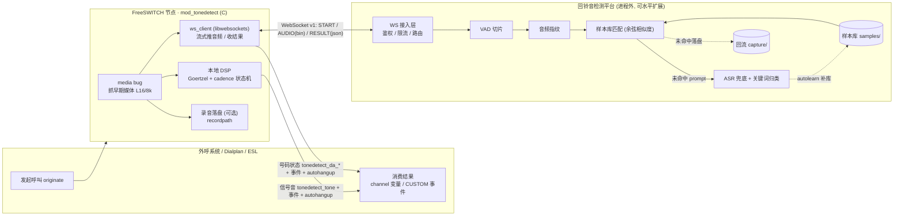
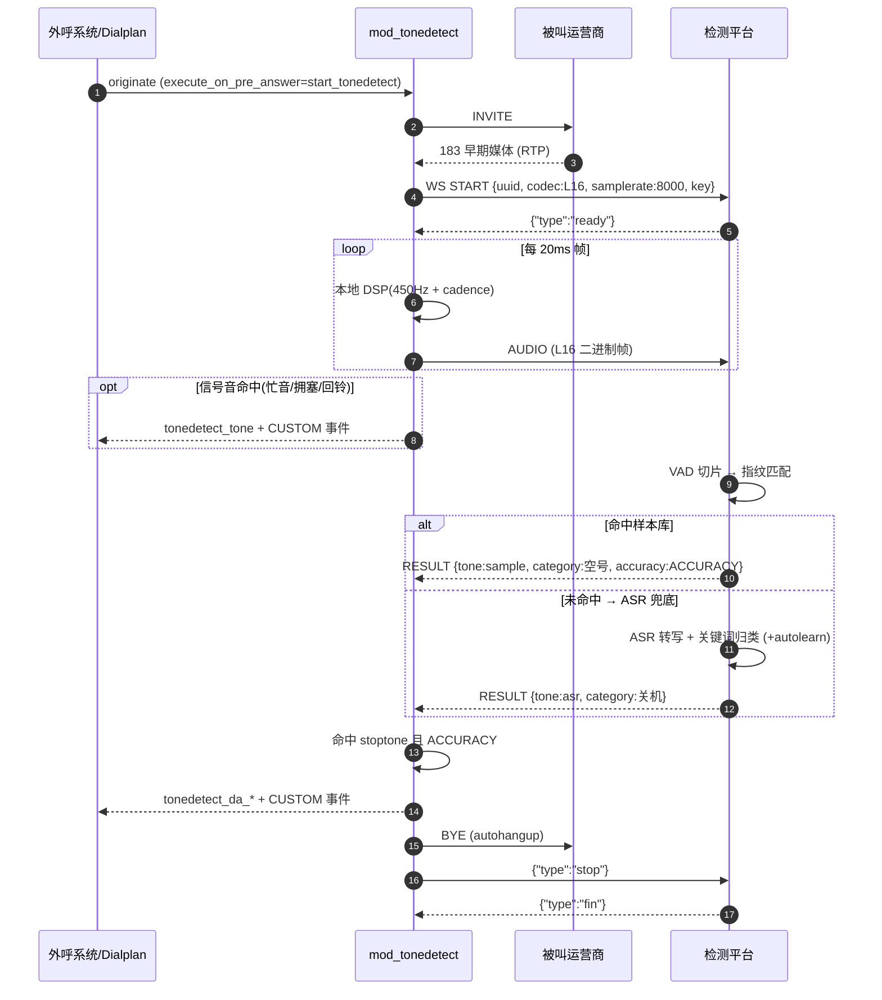
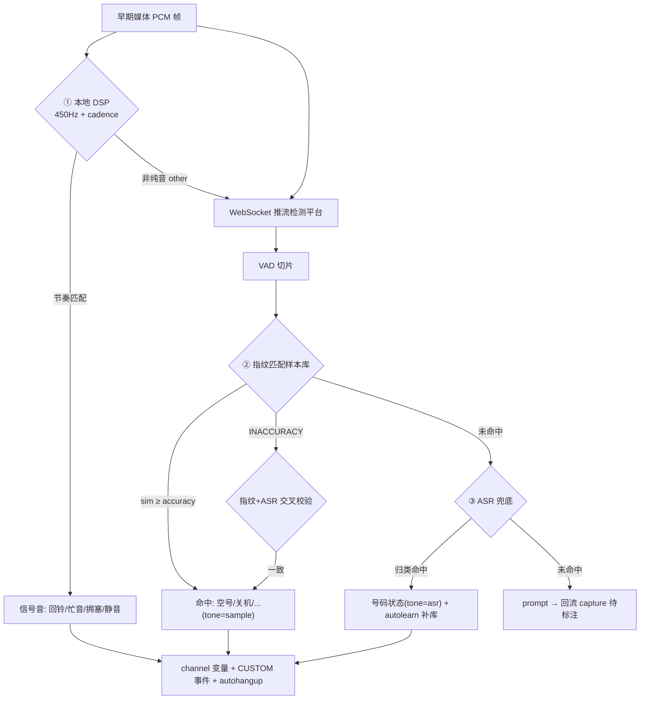
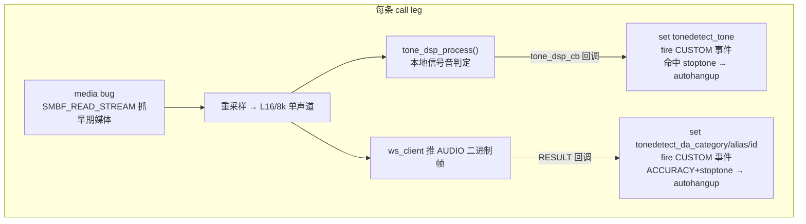
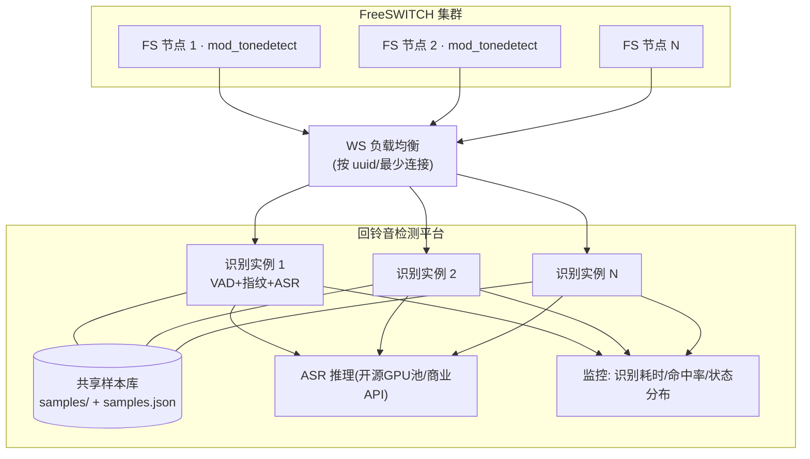
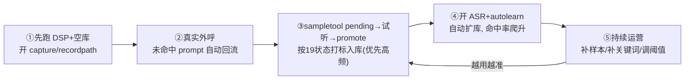

# 回铃音检测 — 技术方案沟通(工程实现版)

> 本文用于回铃音检测项目的技术方案对齐,侧重**工程落地**:架构、时序、协议、模块内部、部署、容量与本期改动。
> 配套实现:[`README.md`](../README.md)、[`docs/INTEGRATION.md`](./INTEGRATION.md)(协议契约)、[`docs/ACCURACY.md`](./ACCURACY.md)、[`server/README.md`](../server/README.md)。

---

## 0. 系统总览(架构图)

整体采用 **"FreeSWITCH 本地模块 + 进程外识别服务"** 的分层架构,职责边界清晰、各层可独立扩缩容与迭代。



**设计原则**:FreeSWITCH 侧(C 模块)只做"**媒体采集 + 结果回填 + 挂机控制**",信号音(纯音)本地直接判;**重计算(VAD/指纹/ASR/样本库)全部放进程外**,用任意语言实现、独立扩缩容、便于算法迭代与私有化部署。

**音频规格(全链路统一)**:L16 / 8kHz / 单声道 / 小端 16-bit PCM,20ms 一帧(160 样本 / 320 字节)。

---

## 1. 什么是回铃音检测,回铃音检测的用处

### 1.1 概念

**回铃音(Ringback Tone / Early Media)** 是主叫在被叫"接通之前"听到的声音,出现在 SIP `183 Session Progress` 携带的**早期媒体(early media)**阶段:

- **信号音(纯音类)**:标准回铃音(国内 450Hz,ON ~1s / OFF ~4s)、忙音、拥塞/快忙、静音。
- **彩铃(CRBT)**:运营商替代标准回铃音的音乐/语音。
- **语音提示音(TTS/录音类)**:空号、关机、停机、暂停服务、通话中、语音信箱、号码不存在等。

**回铃音检测**= 在被叫应答前实时分析早期媒体,**自动判定呼叫接续结果与号码状态**,无需人工去听。

### 1.2 用处

面向**自动外呼 / 智能营销 / 催收 / 通知**等大规模呼叫场景:

| 价值点 | 工程收益 |
|---|---|
| **提速接通** | 听到空号/关机提示音即 `autohangup`,不必等被叫侧 ~60s 超时,缩短单次呼叫占用 |
| **省线路** | 无效号码提前挂断,释放中继并发,提升单位时间有效呼叫量 |
| **提升坐席接通率** | 配合预测式外呼,只把"真人接听"转坐席,过滤机器应答/无效号码 |
| **号码治理** | 号码状态随话单上报,沉淀空号库/活跃库供后续清洗 |

---

## 2. 回铃音检测技术发展简介

| 代际 | 技术 | 处理对象 | 优点 | 缺点 | 本仓库 |
|---|---|---|---|---|---|
| 第一代 | DSP 信号音(频率+节奏) | 纯音 | CPU 极低、毫秒级、离线 | 只能处理标准纯音 | 阶段1 `src/tone_dsp.c` |
| 第二代 | 音频指纹/样本库匹配 | 已知语音提示音 | 快、省、加样本即扩展 | 覆盖度=准确率 | 阶段2 `server/` |
| 第三代 | ASR + 关键词/语义归类 | 未知提示音 | 覆盖广、对新话术鲁棒 | 成本高、有延迟 | 阶段3 `server/` |
| 第四代 | 混合 + 自学习闭环 | 全部 | 速度+覆盖+成本均衡,越用越准 | 工程复杂度高 | 当前形态 |

---

## 3. 我们的业务诉求:实时

> **范围说明**:经评估,**仅保留"实时"场景**;"准实时(录音异步识别随话单上报)"与"数分(闲时/夜间批量)"已**确认舍弃,不在本项目范围内**。下文及后续设计、改造点均只围绕实时。

### 3.1 实时 — 通话中识别

在**被叫应答之前(早期媒体阶段)**就识别出回铃音/号码状态,并能**即时影响本次呼叫**(挂机 / 重路由)。这是价值最高、也是对在线算力与稳定性要求最高的形态。



**关键特性**:毫秒~秒级出结果;结果实时落 channel 变量(`tonedetect_tone`、`tonedetect_da_category/alias`)+ `CUSTOM tonedetect` 事件,触发 autohangup / 重路由;每条 call leg 一条 WebSocket 长连接,需高并发、低延迟。

---

## 4. 采用样本库匹配的技术方案

**流水线**(进程外服务,`server/`):

```
早期媒体 PCM → VAD 切片(语音后停顿 ~200ms 提交一段)
            → 音频指纹(电话频带对数频带能量 → 时间平滑 → 逐帧去均值 → 时间归一 → L2 归一)
            → 与样本库逐条求余弦相似度 → 取最近邻 → 阈值分级(ACCURACY/INACCURACY/LOOSE)
```

**工程要点**:

- **指纹鲁棒性**:对数频带 + 时间平滑 + 去均值 + L2 归一,抗增益/轻噪;只取电话频带(300–3400Hz)。
- **阈值分级**:`--accuracy`(默认 0.75)/ `--inaccuracy`(默认 0.60);**仅 `ACCURACY` 触发挂机/上报**。
- **多变体**:同一 `category/alias` 收多条 `name`(多运营商/地区/措辞),最近邻取最高分。
- **运营闭环**:未命中(`prompt`)段经 `--capture-dir` 自动落盘 → `sampletool promote` 人工打标 → 重载即命中。

| 优点 | 缺点 |
|---|---|
| 快、CPU 省,可大并发在线 | 覆盖度=准确率,需持续采样本 |
| 加样本即扩展、无需训练、即时生效 | 冷启动期命中率低 |
| 结果可解释(命中哪条样本 `name`+`score`) | 全新措辞需先补样本 |

**适用**:关机/空号/停机/通话中等标准提示音(覆盖 >99%),是主力方案。

---

## 5. 采用开源 or 商业 ASR 的技术方案

**流水线**:`指纹未命中(prompt) → ASR 转写 → 关键词/语义归类(states.py) → 命中则 tone=asr + 状态(可 autolearn 补库)`。

ASR 引擎**可插拔**(`server/tonedetect_server/asr.py` 的 `create_asr()`),开源 vs 商业按需选型:

| 维度 | 开源(Whisper / FunASR / Vosk) | 商业(云 ASR API) |
|---|---|---|
| 成本 | 一次性算力投入,边际成本低 | 按量计费,规模大时高 |
| 私有化/合规 | **可完全私有化**,数据不出域 | 数据出域,需评估合规 |
| 准确率 | 中文电话域需自行优化/微调 | 通用开箱即用 |
| 延迟 | 取决于自有算力(可控) | 网络+排队,实时需评估 |
| 运维 | 需自建推理与扩缩容 | 免运维 |

| 优点(相对样本库) | 缺点 |
|---|---|
| 覆盖广、对新话术鲁棒 | CPU/GPU 成本高、并发压力大 |
| 无需逐条采样本 | 有转写延迟 |
| 可做"指纹+ASR 交叉校验"提升置信度 | 短促/嘈杂提示音易转写错 |

**建议**:实时主链路优先指纹,ASR **仅兜底**(只在样本库未命中时调用,控制在线算力开销)。开源 vs 商业按 **数据合规 + 规模成本 + 自有算力** 决策。

---

## 6. 采用混合的技术方案(本期推荐)

**DSP + 指纹 + ASR 三级协同 + 自学习闭环**:



**分工**:① DSP 处理纯音(最快最省) → ② 指纹处理已知提示音(快、可解释) → ③ ASR 兜底未知提示音并 autolearn 补库(下次走指纹快路径)→ 交叉校验降误判。**速度 + 覆盖 + 成本可控 + 越用越准。**

---

## 7. 回铃音检测无法检测出语音助手自动应答的情况

- **本质限制**:回铃音检测只分析**接通前的早期媒体**。手机端"AI 语音助手/智能秘书"等**自动应答属于接通后(被叫 200 OK 应答)**的真人位媒体,声学/语义上与真人接听高度相似,**不在早期媒体阶段**,故**无法在接通前识别为机器应答**。
- **派生问题**:这类应答会被判为"真人接通",可能误转坐席/误计有效接通。
- **缓解(超出回铃音检测范畴,需另立能力)**:接通后增加 **AMD(Answering Machine Detection)** / 对话语义判别,识别"您好,我是 XX 的智能助理…"等开场白;结合"应答超快/无背景噪声/固定开场白"特征辅助;用号码画像沉淀"疑似助手应答"。
- **结论**:回铃音检测解决"接通前"号码状态;"接通后机器应答识别"是**独立课题(AMD)**,本期不在范围。

---

## 8. 本期需要改动的点

### 8.1 FreeSWITCH 需要进行的改造

落地 `mod_tonedetect`(本仓库 `module/`)。**模块内部结构**:



**改造清单**:

1. **编译安装**:针对已安装 FreeSWITCH 构建 `mod_tonedetect.so`(`module/Makefile`,需 `libfreeswitch-dev` + libwebsockets),放入 mod 目录;`modules.conf.xml` 加载;`tonedetect.conf.xml` 放入 `autoload_configs/`。
2. **早期媒体采集**:media bug(`SMBF_READ_STREAM`)抓 183 早期媒体;本地 DSP(`tone_dsp.c`,Goertzel + cadence)判信号音;`ws_client.c`(libwebsockets,`TCP_NODELAY`、逐帧 flush)把 L16 流式推识别服务。
3. **外呼接入**:`execute_on_pre_answer=start_tonedetect` 启动检测:
   ```
   originate {ignore_early_media=consume,execute_on_pre_answer=start_tonedetect}sofia/gateway/NUMBER &park
   ```
   无 183 直接应答的线路用 `execute_on_media`。
4. **结果回填与挂机**:配 `stoptone`(命中即停,默认 `busy silence`)、`autohangup`(默认 true)、`maxdetecttime`(默认 60s);结果落 channel 变量 + `CUSTOM tonedetect` 事件;可被通道变量 `tonedetect_stoptone/autohangup/maxdetecttime` 逐呼覆盖。
5. **节奏阈值现网校准**:按国内 450Hz 标准 + 实测调 `purity_threshold`(0.40)、`silence_rms`(200)、`tone_busy_rule`(`250-450|250-450`)、`tone_congestion_rule`(`550-850|500-850`)、`tone_ringback_rule`(`800-1300|3000-5000`)、`ring_early_off_ms`(2000,提前判回铃提速)。
6. **(可选)录音**:`recordpath` / `tonedetect_record_path` 录早期媒体为 `<uuid>.wav`,仅用于**样本采集与问题排查**(非业务链路)。

配置示例(`tonedetect.conf.xml`):

```xml
<settings>
  <param name="stoptone"      value="busy silence congestion"/>
  <param name="autohangup"    value="true"/>
  <param name="maxdetecttime" value="60"/>
  <param name="server_url"    value="ws://10.0.0.10:9977/"/>
  <param name="server_key"    value="prod-key"/>
  <param name="recordpath"    value="/var/lib/freeswitch/tonedetect_rec"/>
</settings>
```

### 8.2 回铃音检测平台的搭建

> 服务端的详细建设方案(挑战、接口字段完整版、Java 技术架构、集群分层、声纹算法与库管理、ASR 引入)见 **[`docs/回铃音检测平台-服务端建设方案.md`](./回铃音检测平台-服务端建设方案.md)**。

进程外识别服务(`server/`),可水平扩展。**部署架构**:



**组件清单**:

- **WS 接入层**:协议 v1(`START`/`AUDIO`/`RESULT`/`STOP`/`FIN`),鉴权(`server_key`)、限流(`error.reason=limit` 优雅降级)。
- **识别核心**:VAD 切片(`vad.py`)、音频指纹(`fingerprint.py`)、样本匹配(`matcher.py`)、ASR 兜底(`asr.py`)、WS 服务(`server.py`)。
- **样本库管理**:`samples/` + `samples.json`,`sampletool`(pending/promote/add/list/remove);状态按标准表 `states.py`(da2 id 2-20)归一。
- **自学习闭环**:`--capture-dir` 落盘未命中段,`--asr-autolearn` ASR 命中段自动补库热重载。
- **平台化**:水平扩缩容、监控告警(识别耗时 / 命中率 / 各状态分布 / 在线连接数)、样本库版本管理。

启动:

```bash
python -m tonedetect_server --host 0.0.0.0 --port 9977 \
  --samples ./samples --key prod-key \
  --accuracy 0.80 --inaccuracy 0.60 \
  --capture-dir ./capture --asr whisper --asr-autolearn
```

### 8.3 平台冷启动方式

样本库初期为空,采用"边跑边采、由人到机"的闭环(详见 `docs/ACCURACY.md`):



> 冷启动期建议"双轨":结果先**只打标不挂机**,人工抽样校验准确率达标后,再灰度开启 `autohangup`,控制误挂风险。

### 8.4 需要投入的人力预估

> 以下为按工作量拆分的**相对粒度**估算(非日历周期),实际取决于现网 FreeSWITCH 版本、并发规模与 ASR 选型。

| 工作项 | 角色 | 工作量(相对) | 说明 |
|---|---|---|---|
| 模块编译/对接/参数校准(8.1) | C/FS 工程师 | 中 | 编译安装、dialplan 接入、节奏阈值校准、autohangup 灰度 |
| 平台部署 + WS 对接联调(8.2) | 后端工程师 | 中 | 部署、鉴权、端到端联调、监控接入 |
| ASR 接入(开源/商业,8.2) | 算法/后端工程师 | 中~高 | 选型、`create_asr` 接入、关键词归类、(开源)推理运维 |
| 样本库冷启动与运营(8.3) | 运营/标注 + 后端 | 中(持续) | 回流采集、打标入库、覆盖高频状态、长期运营 |
| 平台化(扩缩容/监控) | 后端/运维 | 中 | 并发扩缩容、监控告警、WS 负载均衡 |
| 测试与灰度上线 | 测试 + 全员 | 中 | 离线单测(`make test` / `server/tests`)、端到端、准确率验收、灰度放量 |

**人力建议**:核心约 **C/FreeSWITCH 工程师 1 + 后端 1~2 + 算法 1(ASR)+ 运营/标注 1(持续)**。其中**样本库运营是长期持续投入**,非一次性。

---

## 附:相关文档索引

| 文档 | 内容 |
|---|---|
| [`README.md`](../README.md) | 总体架构、分阶段路线、DSP 算法、构建测试 |
| [`docs/回铃音检测平台-服务端建设方案.md`](./回铃音检测平台-服务端建设方案.md) | 服务端专项:挑战、接口字段完整版、Java 技术架构、集群分层、声纹算法与库管理、ASR 引入 |
| [`docs/INTEGRATION.md`](./INTEGRATION.md) | WebSocket 协议 v1、对接契约、状态对照表(id 2-20)、FreeSWITCH 侧对接 |
| [`docs/ACCURACY.md`](./ACCURACY.md) | 识别全部号码状态与提升准确率指南 |
| [`server/README.md`](../server/README.md) | 识别服务、样本库格式、采集闭环、ASR 兜底 |
