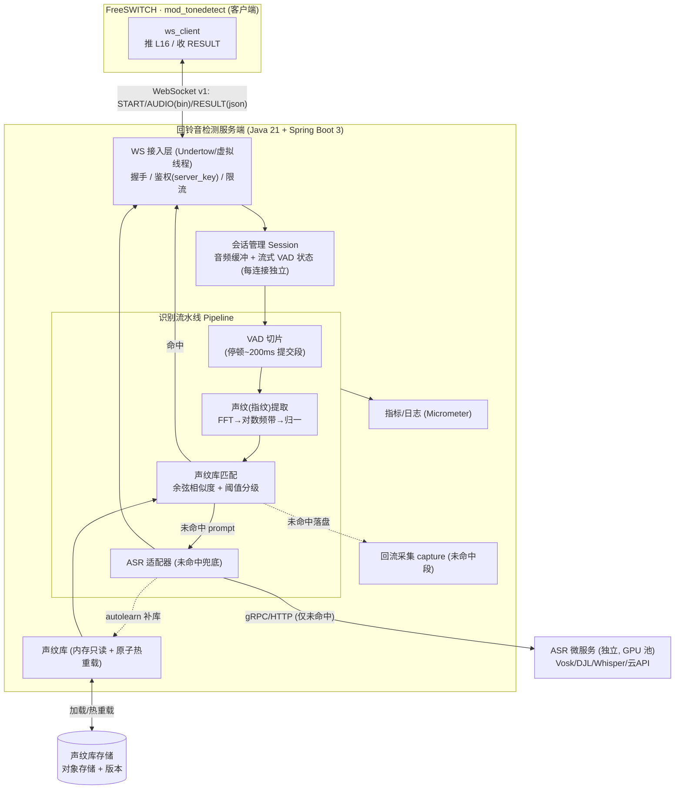
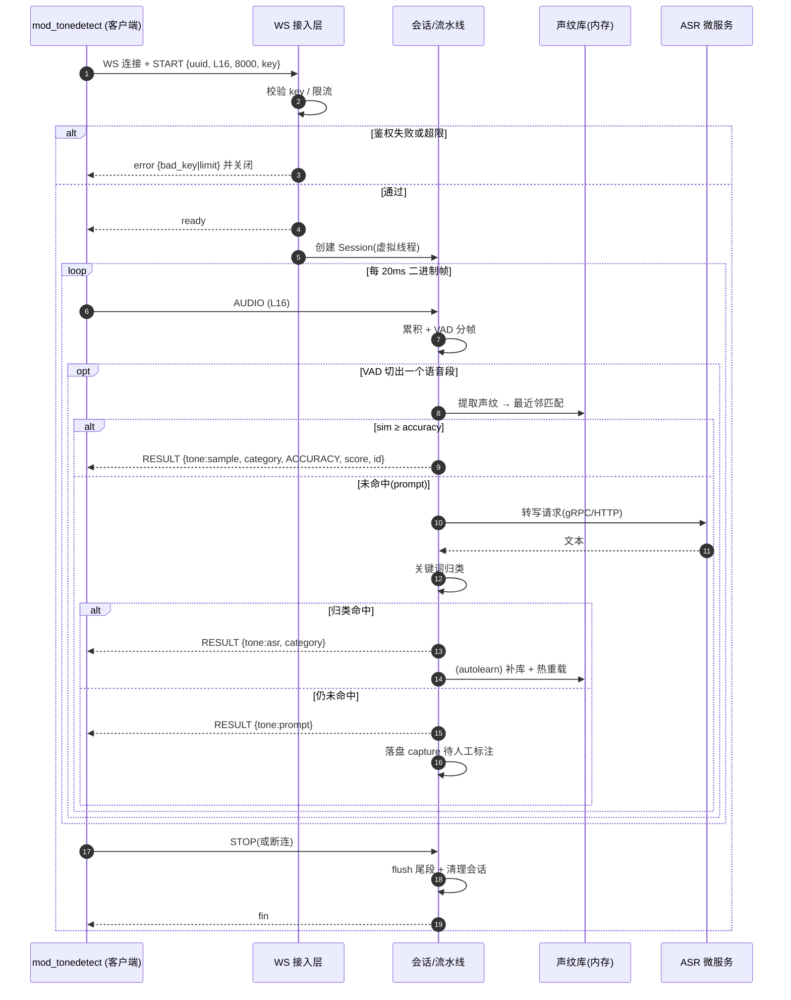
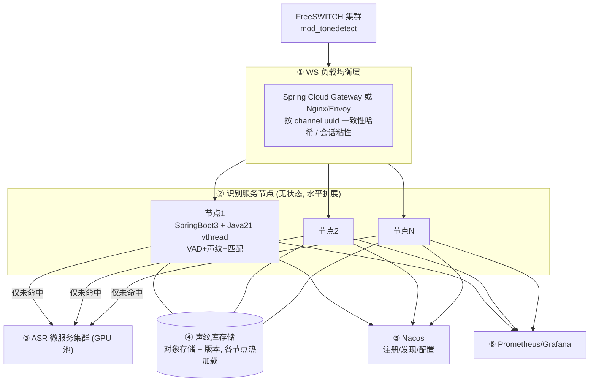
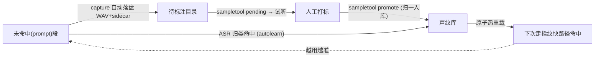
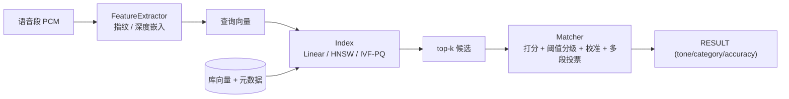

# 回铃音检测平台 — 服务端建设方案(Java 版)

> 本文聚焦**服务端(识别平台)**的建设:挑战、对接契约、技术架构、集群分层、声纹(音频指纹)算法与库管理、外部 ASR 引入。
> 场景范围:**仅实时**(通话中识别,可即时挂机/重路由);准实时与数分不在范围内。
> 技术选型:**Java 21 + Spring Boot 3**(详见 §5)。另有 **[Rust 版](./回铃音检测平台-服务端建设方案-Rust版.md)** 与 **[Python 版](./回铃音检测平台-服务端建设方案-Python版.md)**(各含与 Java 的优缺点对比)。配套:[`docs/INTEGRATION.md`](./INTEGRATION.md)(协议契约)、[`docs/ACCURACY.md`](./ACCURACY.md)、`server/`(现有 Python 参考实现,作算法对拍基线)。

> **术语对齐**:本文"**声纹库 / 声纹匹配**"即工程上的"**音频指纹库 / 指纹匹配**"——对早期媒体语音提示音提取声学指纹并比对,**非说话人声纹识别(speaker recognition)**,而是"提示音音色/时频结构"的匹配。

---

## 1. 服务端面临的挑战有哪些?

| 类别 | 挑战 | 影响 / 应对要点 |
|---|---|---|
| **高并发长连接** | 每条 call leg 一条 WebSocket,外呼峰值数千~万级并发连接 | 连接模型必须可横向扩展;Java 21 **虚拟线程**一连接一线程即可扛量(§5/§6) |
| **低延迟** | 实时挂机价值依赖秒级出结果,任何排队/抖动都会拖慢 | `TCP_NODELAY`、逐帧 flush、识别流水线轻量化;ASR 只兜底不进主路径 |
| **流式有状态** | 音频是 20ms 一帧的连续流,需跨帧累积 + VAD 切片 | 每连接维护独立会话状态(缓冲 + VAD),连接间无共享 |
| **准确率/覆盖度** | 声纹库覆盖度=准确率,运营商/地区/措辞差异大 | 多变体样本 + 阈值分级 + ASR 兜底 + 自学习补库(§7/§8/§9) |
| **冷启动** | 初期声纹库为空,命中率低 | 边跑边采回流 + 人工打标 + ASR 自学习扩库(见 `docs/ACCURACY.md`) |
| **ASR 成本/延迟** | ASR 吃 GPU、有延迟,在线大并发压力大 | ASR 拆为**独立微服务**,仅未命中时调用(§9) |
| **算法移植** | Java 无 numpy,DSP/指纹需自实现 | 用 FFT 库(JTransforms)一比一移植,并与 Python 实现对拍(§5/§7) |
| **热更新** | 新增样本不能停服 | 声纹库**原子热重载**(§8) |
| **集群与负载均衡** | 长连接不能轮询,需会话粘性 | 按 channel `uuid` **一致性哈希**路由(§6) |
| **可观测性** | 需量化识别耗时/命中率/状态分布 | Micrometer + Prometheus + 结构化日志 |
| **健壮性** | 半包/乱序/异常断连/客户端随时关闭 | 连接级隔离,单连接异常不影响他人;优雅清理会话 |
| **安全** | 鉴权、限流、私有化数据不出域 | `server_key` 校验、并发信号量限流、(用开源 ASR)数据不出域 |

---

## 2. 服务端与客户端约定的对接方式与接口文档

**完整契约见 [`docs/INTEGRATION.md`](./INTEGRATION.md)**,此处摘要服务端需实现的协议 v1;**全部字段的完整清单见本文 [附录 A:接口字段完整版](#附录-a接口字段完整版)**。

- **传输**:WebSocket 长连接,每条 call leg 一条。**音频上行=二进制帧,控制/结果=文本帧(JSON)**。
- **音频规格**:L16 / 8kHz / 单声道 / 小端 16-bit PCM,建议 20ms 一帧(160 样本 / 320 字节)。
- **URL**:`ws://host:port/`(内网)/ `wss://`(公网)。

### 2.1 消息流

| 方向 | 消息 | 类型 | 说明 |
|---|---|---|---|
| C→S | `START` | 文本/JSON | 连接后**第一条**,声明媒体参数 + 鉴权 |
| S→C | `ready` / `error` | 文本/JSON | 握手结果 |
| C→S | `AUDIO` | **二进制** | 连续 L16 PCM 帧 |
| S→C | `RESULT` | 文本/JSON | 每识别出一个语音段推一条(可多次) |
| C→S | `STOP` | 文本/JSON | 结束(或直接关连接) |
| S→C | `FIN` | 文本/JSON | 关闭前可发 |

### 2.2 START(client → server)

```json
{ "type":"start", "version":1, "uuid":"<channel-uuid>",
  "codec":"L16", "samplerate":8000, "key":"<auth-key>",
  "params":{ "stoptone":"busy silence", "maxdetecttime":60 } }
```

服务端校验 `key` 通过回 `{"type":"ready"}`,否则 `{"type":"error","reason":"bad_key"}` 并关闭。

### 2.3 RESULT(server → client)

```json
{ "type":"result", "tone":"sample", "category":"空号",
  "alias":"does not exist", "name":"konghao_yidong",
  "accuracy":"ACCURACY", "score":0.93, "id":3,
  "point_begin":1200, "point_end":2600 }
```

| 字段 | 说明 |
|---|---|
| `tone` | `sample`(命中声纹库)/ `asr`(ASR 归类)/ `prompt`(有语音未识别)/ `silence` |
| `accuracy` | `ACCURACY`/`INACCURACY`/`LOOSE` —— **仅 `ACCURACY` 应触发上报/挂机** |
| `score` | 与最佳样本相似度 0..1(指纹路径) |
| `category`/`alias`/`id` | 号码状态(中文/英文/编号,见标准表 id 2-20) |
| `name` | 命中样本名(仅 `tone=sample`);`text` 为 ASR 转写(仅 `tone=asr`) |
| `point_begin`/`point_end` | 语音段在流中的毫秒位置 |

### 2.4 错误码 / 行为契约

- `error.reason`:`bad_key`(鉴权失败)/ `bad_json`(控制帧非法)/ `limit`(并发超限,客户端优雅降级)。
- **最小行为契约**(任意语言实现):接受连接 → 收 `START` 校验回 `ready` → 累积二进制帧按 START 采样率解释 → VAD/识别 → 每结论推 `RESULT`(**只有把握高才用 `ACCURACY`**)→ 收 `STOP`/断连即停。`docs/INTEGRATION.md`
- **号码状态标准表(id 2-20)** 为单一来源,服务端归一引用。`server/tonedetect_server/states.py`

---

## 3. 服务端技术架构交互图



**要点**:接入层 → 会话 → 流水线分层清晰;**重算力(ASR)拆独立微服务**,主链路只跑轻量 DSP/指纹;声纹库内存只读、原子热重载。

---

## 4. 服务端技术架构时序图



---

## 5. 各技术栈的优缺点

### 5.1 总体选型(已定:Java 21 + Spring Boot 3 + 虚拟线程)

| 层 | 选型 | 优点 | 缺点 |
|---|---|---|---|
| **运行时** | Java 21 LTS(虚拟线程) | 一连接一线程的阻塞式写法即可扛高并发,代码简单;JIT 后 DSP 性能好 | 内存占用高于 Go/Rust;启动较慢(可 GraalVM Native 缓解) |
| **框架** | Spring Boot 3.x | 生态全、监控/配置/MQ 开箱即用、招人易;对 Spring Cloud 友好 | 体量重于 Quarkus/Micronaut |
| **WebSocket** | Spring WebSocket + Undertow | 与 Spring 集成顺、二进制帧支持好 | 极限连接数下不如裸 Netty |
| **JSON** | Jackson | 成熟稳定 | — |
| **FFT/DSP** | JTransforms(或 Commons Math) | 纯 Java、快;无外部依赖 | 需自己组装指纹流水线(无 numpy) |
| **音频** | `javax.sound.sampled` | JDK 自带读 WAV | 8k 重采样等需自写 |
| **ASR** | 适配器:Vosk(本地 Java 绑定)/ DJL(Whisper)/ 远程微服务 | 可插拔、可私有化 | 本地中文电话域质量需调优;GPU 运维成本 |
| **可观测** | Micrometer + Prometheus + Logback | 标准、生态好 | — |
| **构建/部署** | Maven + Docker(可选 GraalVM Native) | 企业常见、CI 成熟 | Native 编译有约束 |

### 5.2 并发模型对比(关键决策)

| 方案 | 模型 | 单机连接 | 开发复杂度 | Spring Cloud 友好 | 适用 |
|---|---|---|---|---|---|
| **Java 21 虚拟线程 + Spring WebSocket** | 一连接一虚拟线程,阻塞式 | 高(千~万) | **低** | 高 | **主推** |
| Spring WebFlux + Reactor Netty | 事件驱动/响应式 | 很高 | 中~高 | 高(Gateway 同栈) | 极致并发/纯网关 |
| 裸 Netty | 事件驱动,手控 ByteBuf | 最高 | 高 | 中 | 极限性能/自定义协议 |

> 结论:识别节点用**虚拟线程**最简单够用;**Spring Cloud Gateway 底层即 Netty**,网关层自然拥有 Netty 能力,无需在节点里裸写 Netty。

---

## 6. 服务端集群分层架构

回铃音检测集群是**"无共享、可水平扩展的扇出型"**:连接相互独立、无跨连接广播,**不需要分布式 Session / Redis Pub-Sub / 消息 broker**。重点只在"单机扛多少连接"与"连接如何均匀分布"。



| 层 | 职责 | 选型 |
|---|---|---|
| ① 负载均衡 | WS 路由、会话粘性、统一鉴权/限流 | Spring Cloud Gateway(Spring 生态)或 Nginx/Envoy |
| ② 识别节点 | 无状态,各自处理本机连接 | Spring Boot 3 + 虚拟线程 |
| ③ ASR 微服务 | 重算力,独立扩缩容 | 见 §9 |
| ④ 声纹库 | 只读 + 版本,各节点加载/热重载 | 对象存储(S3/MinIO) |
| ⑤ 注册/配置 | 服务发现、动态配置 | Nacos / Eureka |
| ⑥ 可观测 | 指标/日志/告警 | Micrometer + Prometheus + Grafana |

**路由策略**:长连接**禁用轮询**,按 FreeSWITCH `uuid` 做**一致性哈希**(`START` 携带 uuid),保证均匀分布且扩缩容时重哈希迁移最小(已建连接不受影响)。`docs/INTEGRATION.md`

---

## 7. 声纹库与声纹匹配的算法原理

> 即"音频指纹库 + 指纹匹配"。原理与现有 Python 实现一致,Java 侧一比一移植并对拍。`server/tonedetect_server/fingerprint.py`、`server/tonedetect_server/matcher.py`

### 7.1 声纹(指纹)提取流水线

```
一段语音 PCM
  → 分帧加窗(32ms 窗 / 16ms 跳,汉宁窗)
  → FFT 功率谱
  → 电话频带(200–3400Hz)聚合为 16 个对数频带能量(log1p 压缩)
  → 3 帧时间平滑(抑制加性噪声)
  → 逐帧去均值(增益/音量无关)
  → 时间轴线性重采样到固定 32 帧(不同时长可比)
  → 展平 + L2 归一化 → 定长声纹向量
```

设计意图:
- **对数频带 + 去均值** → 对音量/增益变化不敏感;
- **时间平滑** → 抗轻度噪声;
- **时间归一** → 容忍不同语速/时长;
- 仍**保留时频结构**,可区分"已关机"/"是空号"等不同提示音。

### 7.2 声纹匹配与判级

```
查询段声纹 fp
  → 与库内每条样本声纹求余弦相似度(= L2 归一向量点积)
  → 取最近邻 best, best_score
  → best_score ≥ accuracy(默认 0.75)        → ACCURACY  (命中, tone=sample)
    best_score ≥ inaccuracy(默认 0.60)       → INACCURACY(候选, 可交叉校验)
    否则                                       → LOOSE     (视为未命中 prompt)
```

- **仅 `ACCURACY`** 才触发上报/挂机;`INACCURACY` 可用 ASR 复核,一致则升级(降误判)。`docs/ACCURACY.md`
- **多变体提升覆盖**:同一 `category/alias` 收多条 `name`(多运营商/地区/措辞),最近邻取最高分。
- **阈值可调**:追求"准"调高 `accuracy`,追求"全"调低 `inaccuracy` + 开 ASR 兜底。

### 7.3 Java 移植注意

- FFT 用 JTransforms;频带边界用对数刻度 `logspace(200,3400,17)`;向量运算自写或用数组循环(JIT 后够快)。
- **务必与 Python 实现对拍**:同一 WAV 在两端产出的 `score` 应一致(单测用例从 `server/tests` 迁移)。`server/tests`

---

## 8. 声纹库的管理机制

### 8.1 库结构

声纹库 = 一个目录 + `samples.json` 索引 + 若干 8kHz/16bit 单声道 WAV:

```json
[ { "file":"konghao_yidong.wav", "name":"konghao_yidong",
    "alias":"does not exist", "category":"空号", "id":3 } ]
```

加载时为每条样本**预计算声纹**,常驻内存供匹配。`server/tonedetect_server/matcher.py`

### 8.2 管理操作(对齐现有 `sampletool`)

| 操作 | 说明 |
|---|---|
| **add** | 入库一个 WAV:自动转 8k 单声道、按标准表归一 `alias/category` 并写 `id`,同名覆盖 |
| **list** | 列出库内样本 |
| **remove** | 删除样本及其 WAV |
| **promote** | 把回流目录中一条未命中录音正式入库,并清理其 sidecar |
| **pending** | 查看待标注的回流录音 |

入库时 `alias/category` 经 `states.normalize()` 归一(给其一补全另一并写 `id`),避免标签发散;`strict` 模式拒绝非标准状态。`server/tonedetect_server/library.py`、`server/tonedetect_server/states.py`

### 8.3 采集闭环(冷启动 → 高准确率)



来源:① 服务端自动回流(未命中段)② mod 侧 `recordpath` 录全段供裁剪。详见 `docs/ACCURACY.md`、`server/README.md`。

### 8.4 热重载与版本

- **原子热重载**:新库加载为不可变结构,`AtomicReference` 整体替换,读侧无锁、不停服。
- **版本管理**:声纹库随对象存储版本化,支持灰度切换与回滚;集群各节点拉取同一版本,保证一致。
- **归一约束**:统一 8k 单声道、统一标准状态表,保证库内一致与跨节点可比。`server/tonedetect_server/library.py`

---

## 9. 如何集成或引入外部的 ASR 能力

ASR 是**样本库未命中时的兜底**,覆盖尚未收录的措辞,**不进主链路**。`server/tonedetect_server/asr.py`

### 9.1 集成原则

- **可插拔适配器**:定义统一接口 `transcribe(short[] pcm, int rate) -> text`,实现可换(本地/远程/云)。对应现有 `create_asr()` 工厂。`server/tonedetect_server/asr.py`
- **仅兜底调用**:只有指纹匹配为 `prompt`(或 `INACCURACY` 需复核)时才调 ASR,控制成本与延迟。
- **强烈建议拆独立微服务**:ASR 吃 GPU、延迟高,独立部署 + 独立扩缩容,识别节点经 gRPC/HTTP 调用(§3/§6)。

### 9.2 引擎选项

| 方式 | 代表 | 优点 | 缺点 |
|---|---|---|---|
| **本地 Java 绑定** | Vosk(原生 Java API) | 私有化、JVM 内直调、无跨进程 | 中文电话域准确率需调优 |
| **JVM 跑模型** | DJL(加载 Whisper/PyTorch) | 留在 JVM、模型可换 | 需 GPU、内存大 |
| **独立 Python 微服务** | faster-whisper / FunASR + gRPC | **ASR 生态最强**、独立扩缩容、与 Java 解耦 | 多一跳网络 |
| **商业云 API** | 云厂商 ASR | 免运维、开箱准 | 数据出域需合规、按量计费 |

> 推荐:**Java 识别节点 + 独立 Python/GPU ASR 微服务(faster-whisper/FunASR)**——发挥 Java 高并发与 Python ASR 生态各自所长,契合"ASR 仅兜底"的设计。强私有化诉求可用 Vosk 本地绑定起步。

### 9.3 转写后归类与自学习

- **关键词/语义归类**:转写文本按标准表 `states.py` 的 `keywords` 映射到号码状态(先具体后宽泛,"稍后再拨"放最末避免误判),命中即返回 `tone=asr`。`server/tonedetect_server/asr.py`、`server/tonedetect_server/states.py`
- **自学习(autolearn)**:ASR 归类命中的段可**自动补入声纹库并热重载**,使下次走更快更准的指纹路径——系统越用越准。`docs/ACCURACY.md`
- **交叉校验**:指纹候选为 `INACCURACY` 时用 ASR 复核,一致则升 `ACCURACY`(`confirmed_by=asr`),降低误判。

---

## 10. 容量规划与 SLO

> 以下为**可验收的工程目标基线**,数值需按实际硬件压测校准;这里给出口径与估算方法。

### 10.1 SLO 目标(示例基线)

| 指标 | 目标 | 说明 |
|---|---|---|
| 首结果延迟(早期媒体→首个 `ACCURACY`) | p50 ≤ 1.5s,p99 ≤ 3s | 受提示音实际播放时点影响 |
| 单段识别延迟(VAD 出段→`RESULT`,指纹路径) | p99 ≤ 50ms | 纯服务端处理,不含等待音频 |
| 服务可用性 | ≥ 99.9% | 检测平台维度 |
| 误挂率(误 `autohangup`) | < 0.1% | 仅 `ACCURACY` + 多段一致触发 |
| 过载行为 | 超容量回 `limit` 且不雪崩 | 拒绝优于堆积 |

### 10.2 延迟预算分解

| 阶段 | 预算(指纹路径) | 备注 |
|---|---|---|
| 网络上行(每帧) | < 5ms | 内网,`TCP_NODELAY` |
| VAD 切片 | 段结束即触发 | 受 hangover(~200ms)影响出段时机 |
| 指纹提取 | < 15ms | FFT + 频带聚合(每段) |
| 匹配检索 | < 10ms(线性小库)/ < 5ms(ANN 大库) | 见 §12 |
| 回传 RESULT | < 5ms | — |
| (兜底)ASR | 预算外,异步隔离 | 见 §11,超时熔断,不阻塞主路径 |

### 10.3 容量估算与压测

- **单核可承载实时流数** ≈ `1000ms / (每段处理ms × 每秒出段数)`;指纹路径每段处理轻、出段稀疏,单核可承载大量并发流。
- **按目标并发反推节点数**:`节点数 = 峰值并发连接 / 单节点稳态连接上限`;单节点上限由 CPU(指纹)与内存(连接+样本库)共同约束。
- **压测方法**:① 连接爬坡(ramp)定位拐点;② 稳态长稳(soak)看内存/句柄泄漏;③ 尾延迟(p99/p999);④ 过载注入验证 `limit` 降级;⑤ 用**真实早期媒体 WAV 回放**驱动(而非静音),覆盖指纹/ASR 两条路径。工具:Gatling / k6 / 自研 WS 压测客户端。

---

## 11. 稳定性与容错

### 11.1 故障域与降级原则(核心)

**检测平台是"增强项"而非"卡点":任何故障都必须 fail-open——退化为"本通不识别",绝不因检测故障误挂或卡住呼叫。**

| 故障 | 行为 |
|---|---|
| 检测平台不可达 / 握手失败 | mod 跳过检测,呼叫照常进行 |
| WS 连接中断 | mod 有限次快速重连;失败则放弃本通检测(会话内存态丢失可接受,单通粒度) |
| 识别超 `maxdetecttime` | 停止检测,按未识别处理 |
| ASR 故障/超时 | 该段返回 `prompt`,不影响指纹主路径 |

### 11.2 ASR 兜底隔离(必须)

ASR 抖动不能反噬实时主路径:
- **超时**:单次转写硬超时(如 800ms),超时即视为未命中。
- **熔断(circuit breaker)**:错误率/延迟超阈则短路一段时间,直接走 `prompt`,定期半开探测恢复。
- **隔离舱(bulkhead)**:ASR 调用用独立线程池/连接池 + 信号量上限,与主链路资源隔离。
- **背压**:ASR 队列有界,满则跳过(宁可不兜底,不可拖垮)。

### 11.3 过载保护

- 连接级信号量 + 每节点最大并发上限;超限握手回 `error.reason=limit`。
- 队列有界,**拒绝优于无界堆积**;配合 LB 把溢出导向其它节点。

### 11.4 健康检查与优雅启停

- **liveness**:进程/事件循环存活;**readiness**:样本库已加载 + 依赖就绪才接流量。
- **优雅启停**:停机先从 LB/注册中心摘除 → 停止接新连接 → drain 现有连接至自然结束或超时 → 退出。

### 11.5 热重载竞态与灰度一致性

- 新库加载为独立对象,**原子切换引用**;进行中的匹配用旧引用跑完,无锁无中断。
- 集群按节点**分批切换库版本**(灰度),避免全量同时切换导致结果跳变;库版本随结果可上报便于追溯。

### 11.6 可观测与告警

| 类别 | 指标 | 告警/SLO 关联 |
|---|---|---|
| 流量 | 并发连接数、QPS、出段速率 | 容量水位 |
| 质量 | 各 `tone` 命中率、`ACCURACY` 占比、误挂率 | 准确率回归 |
| 延迟 | 单段识别 p50/p99、首结果延迟 | SLO |
| ASR | 调用量、超时率、熔断状态 | 兜底健康 |
| 资源 | CPU/内存/句柄、样本库版本与加载状态 | 稳定性 |

按 SLO 设告警阈值与错误预算,沉淀核心看板。

---

## 12. 可扩展架构:特征/匹配/索引抽象 + 大库 ANN 检索

> 解决两件事:① 线性扫描 O(N) 随库增长退化的**性能**问题;② 匹配算法写死、难以演进的**扩展性**问题。把 [`声纹库与声纹匹配-算法实现原理`](./声纹库与声纹匹配-算法实现原理.md) 的能力接入主链路。

### 12.1 三层可插拔抽象



接口职责(语言无关,Java 以 interface 表达):
- **`FeatureExtractor`**:`extract(pcm, rate) -> vector`;实现:`FingerprintExtractor`(对数频带,默认)、`EmbeddingExtractor`(ECAPA/CLAP,经 ONNX/DJL 推理)。
- **`Index`**:`add/remove/search(query, k) -> [(id, score)]`;实现:`LinearIndex`(小库,精确)、`HnswIndex`(大库,ANN)、`IvfPqIndex`(亿级,量化)。
- **`Matcher`**:组合 Extractor + Index,做阈值分级(`ACCURACY/INACCURACY/LOOSE`)、校准、多段投票、(可选)指纹+ASR 交叉校验。

### 12.2 路由与演进

- **按库规模选 Index**:数百~数千用 `LinearIndex`(零依赖、精确);上万~百万切 `HnswIndex`(高召回低延迟);亿级用 `IvfPqIndex`。见算法文档 §3.6。
- **多 Extractor 共存与灰度**:指纹为主、深度嵌入为升级路径;可双跑对比后切换,主链路与协议不变。
- **大库检索运维**:HNSW 在线检索 + 后台重建;**库版本与索引版本一起发布**,与 §11.5 的灰度切换协同。

> 落地建议:**起步用 `Fingerprint + LinearIndex`(最简、可解释);库增大切 `HNSW`;需要强泛化/少样本时引入 `EmbeddingExtractor`**——三步演进,均不改对外协议。

---

## 13. 协议演进与安全加固

### 13.1 协议演进与向后兼容

- **版本驱动**:`START.version` 标识协议版本;非破坏性变更升小版本,破坏性变更升大版本并**双跑过渡**。
- **字段兼容**:新增字段一律"**可选 + 默认安全**",旧客户端**忽略未知字段**;服务端不得因缺省可选字段而失败。
- **能力协商(可选)**:`START` 可带 `capabilities`,服务端 `ready` 回 `supported`,实现按能力降级。

### 13.2 安全加固

- **传输**:公网用 `wss`(TLS);内网按需。证书与 `server_key` 支持**轮转**(灰度生效)。
- **接入控制**:按租户/来源限流与配额;鉴权失败快速拒绝(`bad_key`)。
- **输入加固**:`START` 必填字段校验;**二进制帧大小上限**;慢连接/空闲超时;防超大消息与连接耗尽型 DoS。
- **数据合规**:用开源 ASR 可做到**数据不出域**;录音/回流样本按合规留存与脱敏。

---

## 附录 A:接口字段完整版

本附录列全服务端需实现/产出的所有字段,作为 §2 的完整参考。协议版本 **v1**;音频 **L16 / 8kHz / 单声道 / 小端 16-bit PCM**,建议 20ms 一帧(160 样本 / 320 字节)。权威来源:[`docs/INTEGRATION.md`](./INTEGRATION.md)。

### A.1 连接

| 项 | 取值 |
|---|---|
| URL | `ws://host:port/`(内网)/ `wss://host:port/`(公网) |
| 子协议 | 无强制要求 |
| 低延迟 | `TCP_NODELAY`(关 Nagle)、逐帧 flush |
| 连接粒度 | 每条 call leg 一条 WebSocket |

### A.2 START(client → server,文本/JSON)

连接后客户端的**第一条**消息。

| 字段 | 类型 | 必填 | 说明 |
|---|---|---|---|
| `type` | string | 是 | 固定 `"start"` |
| `version` | int | 是 | 协议版本,当前 `1` |
| `uuid` | string | 是 | FreeSWITCH 通道 uuid(服务端日志/回流命名/集群一致性哈希键) |
| `codec` | string | 是 | 固定 `"L16"` |
| `samplerate` | int | 是 | 采样率,通常 `8000` |
| `key` | string | 否 | 鉴权 key(为空则不校验) |
| `params` | object | 否 | 透传检测参数,见下 |
| `params.stoptone` | string | 否 | 命中即停的信号音(空格/逗号分隔) |
| `params.maxdetecttime` | int | 否 | 最大检测秒数 |

```json
{ "type":"start", "version":1, "uuid":"<channel-uuid>",
  "codec":"L16", "samplerate":8000, "key":"<auth-key>",
  "params":{ "stoptone":"busy silence", "maxdetecttime":60 } }
```

### A.3 握手响应(server → client,文本/JSON)

| 消息 | 字段 | 说明 |
|---|---|---|
| 成功 | `{ "type":"ready" }` | 校验通过,可开始收音频 |
| 失败 | `{ "type":"error", "reason":"<code>" }` | 校验失败,随后关闭连接 |

### A.4 AUDIO(client → server,二进制)

START 之后的所有**二进制帧**:原始小端 16-bit PCM,单声道,采样率取自 START(通常 8000)。建议 20ms 一帧。**服务端须按 int16 小端、单声道解释,且不截断大消息**(`max_size` 放开或按帧累积)。

### A.5 RESULT(server → client,文本/JSON)

服务端每识别出一个语音段推送一条(一连接可多条)。

| 字段 | 类型 | 出现条件 | 说明 |
|---|---|---|---|
| `type` | string | 总是 | 固定 `"result"` |
| `tone` | string | 总是 | `sample`(命中声纹库)/ `asr`(ASR 归类)/ `prompt`(有语音未识别)/ `silence` |
| `accuracy` | string | 总是 | `ACCURACY` / `INACCURACY` / `LOOSE` —— **仅 `ACCURACY` 应触发上报/挂机** |
| `score` | number | 指纹路径 | 与最佳样本的余弦相似度,约 `[-1,1]`(通常 `0..1`) |
| `category` | string | `sample`/`asr` | 号码状态中文类别(见 A.8) |
| `alias` | string | `sample`/`asr` | 号码状态英文别名(见 A.8) |
| `id` | int | 命中状态时 | 号码状态编号(2-20,便于映射 SIP 挂机码) |
| `name` | string | 仅 `tone=sample` | 命中的样本名 |
| `text` | string | 仅 `tone=asr` | ASR 转写文本 |
| `confirmed_by` | string | 交叉校验时 | 如 `asr`,表示指纹候选经 ASR 复核升级为 `ACCURACY` |
| `point_begin` | int | 总是 | 语音段在流中的起始毫秒 |
| `point_end` | int | 总是 | 语音段在流中的结束毫秒 |

```json
{ "type":"result", "tone":"sample", "category":"空号",
  "alias":"does not exist", "name":"konghao_yidong", "id":3,
  "accuracy":"ACCURACY", "score":0.93,
  "point_begin":1200, "point_end":2600 }
```

### A.6 STOP / FIN

| 方向 | 消息 | 说明 |
|---|---|---|
| C→S | `{ "type":"stop" }` | 客户端结束(或直接关闭连接) |
| S→C | `{ "type":"fin" }` | 服务端关闭前可发 |

### A.7 错误码(`error.reason`)

| reason | 含义 | 客户端建议动作 |
|---|---|---|
| `bad_key` | 鉴权失败 | 检查 `key`,不重试 |
| `bad_json` | START/控制帧 JSON 非法 | 修正报文 |
| `limit` | 并发超限 | 优雅降级(本通跳过识别) |

### A.8 号码状态标准表(id 2-20,完整)

单一来源 `server/tonedetect_server/states.py`;服务端入库/归类/上报均引用,Java 侧需 1:1 复刻。

| id | category(中文) | alias(英文) | 说明 |
|---|---|---|---|
| 2 | 关机 | power off | 关机 |
| 3 | 空号 | does not exist | 空号 |
| 4 | 停机 | out of service | 停机(欠费很久给停机) |
| 5 | 正在通话中 | hold on | 通话中(多数交换机拒接/无应答也返回此) |
| 6 | 用户拒接 | not convenient | 用户拒接 |
| 7 | 无法接通 | is not reachable | 无法接通(可能没信号) |
| 8 | 暂停服务 | not in service | 暂停服务(刚欠费被限制呼入) |
| 9 | 用户正忙 | busy now | 用户正忙 |
| 10 | 拨号方式不正确 | not a local number | 拨号方式不正确(一般需加0) |
| 11 | 呼入限制 | barring of incoming | 呼入限制 |
| 12 | 来电提醒 | call reminder | 秘书服务/来电提醒/语音信箱/留言 |
| 13 | 呼叫转移失败 | forwarded | 呼叫转移失败 |
| 14 | 网络忙 | line is busy | 网络忙(一般局端故障) |
| 15 | 无人接听 | not answer | 无人接听 |
| 16 | 欠费 | defaulting | 欠费(主叫或被叫) |
| 17 | 无法接听 | cannot be connected | 无法接听 |
| 18 | 改号 | number change | 改号(用户换号) |
| 19 | 线路故障 | line fault | 线路不能呼出(如 SIM 卡欠费) |
| 20 | 稍后再拨 | redial later | 各种稍后再拨提示 |

> 关键词归类优先级"先具体后宽泛"("稍后再拨"放最末避免误判);各状态的 ASR 关键词见 `states.py` 的 `keywords`。`server/tonedetect_server/states.py`

### A.9 信号音类型(本地 DSP / 服务粗分)

| 值 | 含义 | 来源 |
|---|---|---|
| `ringback` | 回铃音 | 本地 DSP |
| `busy` | 忙音 | 本地 DSP |
| `congestion` | 拥塞/快忙 | 本地 DSP |
| `colorringback` | 彩铃(音乐) | 服务粗分 |
| `450hz` | 450Hz 嘟音 | 本地 DSP |
| `silence` | 静音 | 本地 DSP |
| `prompt` | 未识别语音提示 | 服务 |
| `other` | 非纯音(疑似彩铃/语音) | 本地 DSP 粗分 |

### A.10 结果落地 —— FreeSWITCH channel 变量与事件(供上游消费,非服务端产出)

服务端经 WebSocket 回 `RESULT` 后,`mod_tonedetect` 落地为下列 channel 变量 / `CUSTOM` 事件,供外呼系统读取(完整说明见 `docs/INTEGRATION.md` §5)。

**每通可覆盖的入参(呼叫前 set/export)**

| 变量 | 说明 |
|---|---|
| `tonedetect_stoptone` | 命中即停的信号音(`busy ringback congestion 450hz silence other` 或 `all`) |
| `tonedetect_autohangup` | `true`/`false`,命中即自动挂机 |
| `tonedetect_maxdetecttime` | 最大检测秒数 |
| `tonedetect_record_path` | 早期媒体录音目录(样本采集用) |

**结果 channel 变量**

| 变量 | 来源 | 说明 |
|---|---|---|
| `tonedetect_tone` | 本地 DSP | 信号音类型(见 A.9) |
| `tonedetect_finish_cause` | mod | 停止原因:`stoptone`/`timeout`/`sample`/`stop` |
| `tonedetect_da_tone` | 服务端 | `sample`/`asr`/`prompt` |
| `tonedetect_da_category` | 服务端 | 号码状态类别 |
| `tonedetect_da_alias` | 服务端 | 号码状态英文别名 |
| `tonedetect_da_accuracy` | 服务端 | `ACCURACY`/`INACCURACY`/`LOOSE` |

**CUSTOM 事件头**(`Event-Name: CUSTOM`,`Event-Subclass: tonedetect`)

| 头 | 说明 |
|---|---|
| `tonedetect_tone` | 本地 DSP 信号音类型 |
| `tonedetect_begin_ms` / `tonedetect_end_ms` | 证据时间(流相对毫秒) |
| `tonedetect_source` | `server` 表示来自识别服务 |
| `tonedetect_da_tone` / `tonedetect_da_category` / `tonedetect_da_alias` / `tonedetect_da_accuracy` | 服务端识别结果 |

---

## 附:相关文档索引

| 文档 | 内容 |
|---|---|
| [`docs/回铃音检测平台-服务端建设方案-Rust版.md`](./回铃音检测平台-服务端建设方案-Rust版.md) | 服务端建设方案 **Rust 版**(含 Java vs Rust 优缺点对比) |
| [`docs/回铃音检测平台-服务端建设方案-Python版.md`](./回铃音检测平台-服务端建设方案-Python版.md) | 服务端建设方案 **Python 版**(复用现有 `server/`,含 Java vs Python 对比) |
| [`docs/回铃音检测-技术方案沟通.md`](./回铃音检测-技术方案沟通.md) | 总体技术方案沟通(工程实现版) |
| [`docs/INTEGRATION.md`](./INTEGRATION.md) | WebSocket 协议 v1、对接契约、状态对照表(id 2-20)、FreeSWITCH 侧对接 |
| [`docs/ACCURACY.md`](./ACCURACY.md) | 识别全部号码状态与提升准确率指南 |
| [`server/README.md`](../server/README.md) | 现有 Python 参考实现(算法对拍基线) |
