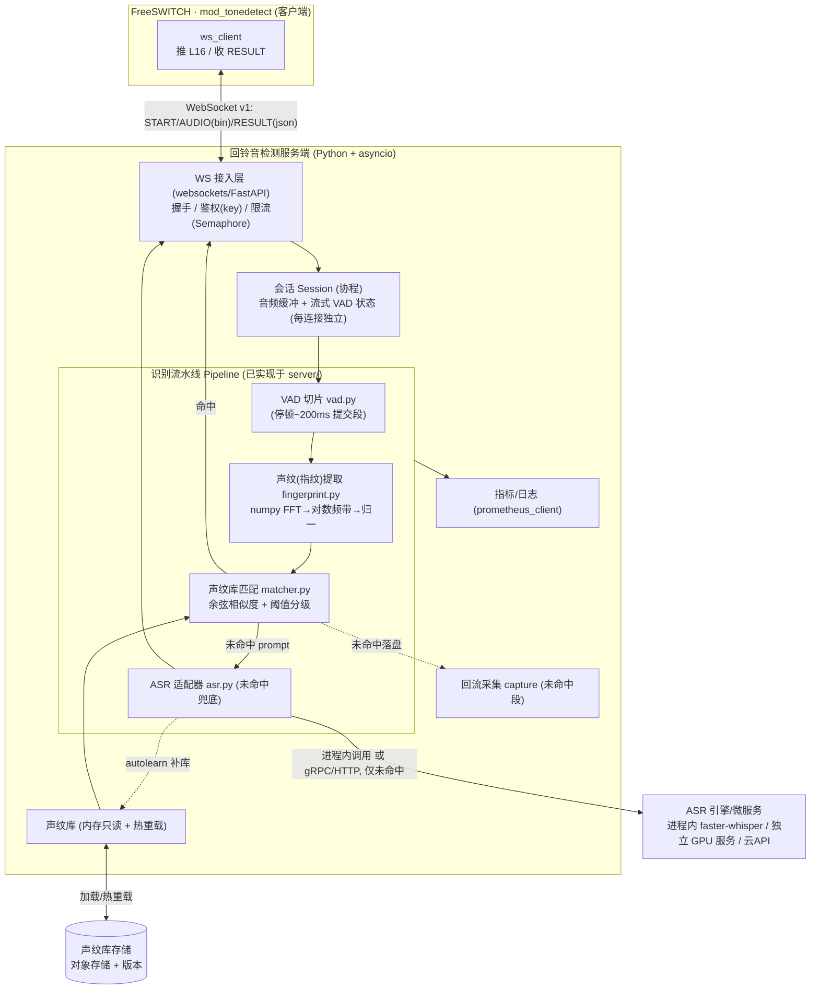
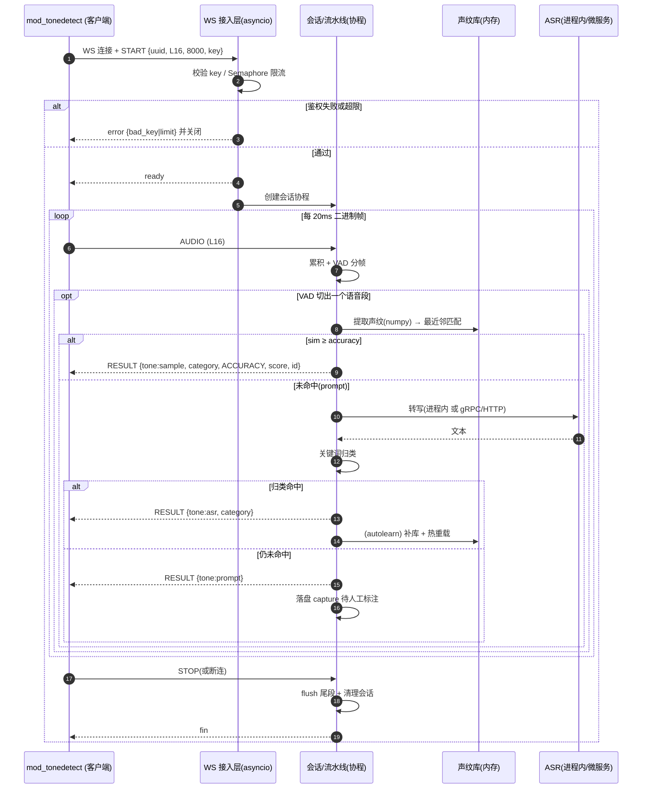
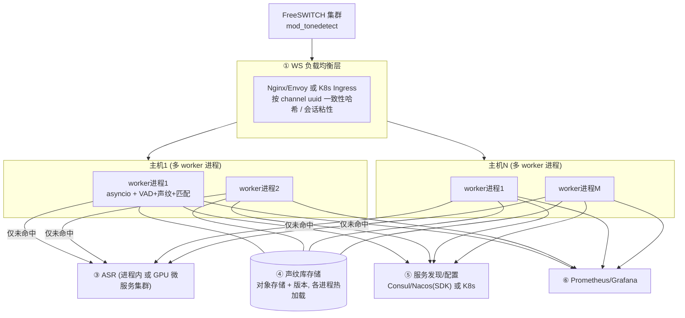
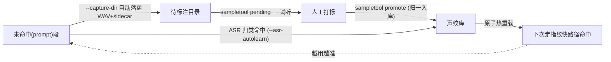

# 回铃音检测平台 — 服务端建设方案(Python 版)

> 本文是服务端建设方案的 **Python 技术栈版本**,与 [Java 版](./回铃音检测平台-服务端建设方案.md)、[Rust 版](./回铃音检测平台-服务端建设方案-Rust版.md) 结构一一对应;三版**架构、协议契约、算法原理完全相同**,差异仅在语言/框架选型与运行特性。
> 场景范围:**仅实时**。配套:[`docs/INTEGRATION.md`](./INTEGRATION.md)(协议契约)、[`docs/ACCURACY.md`](./ACCURACY.md)。
> **关键前提**:本仓库 **`server/` 已是一套可运行的 Python 参考实现**(WebSocket + VAD + 音频指纹 + 样本库 + ASR 兜底),Python 版本质上是"**将现有 `server/` 产品化、集群化**",落地成本最低。`server/README.md`
> **§10 给出 Java 版与 Python 版的优缺点对比**,供选型决策。

> **术语对齐**:"声纹库 / 声纹匹配"= 工程上的"音频指纹库 / 指纹匹配"(提示音音色/时频结构匹配,**非说话人声纹识别**)。

---

## 1. 服务端面临的挑战有哪些?

挑战与其他语言版一致;Python 视角下的侧重点:

| 类别 | 挑战 | Python 应对要点 |
|---|---|---|
| **高并发长连接** | 峰值数千~万级并发 WS | asyncio 单线程事件循环扛 IO;**CPU 密集靠多进程横扩**(规避 GIL) |
| **GIL / CPU 并行** | 指纹计算是 CPU 密集,GIL 限制单进程并行 | numpy 计算下沉 C 层;**多 worker 进程**或 `ProcessPoolExecutor` 提升并行 |
| **低延迟** | 实时挂机依赖秒级响应 | 段计算量小 + numpy 向量化;ASR 只兜底不进主路径 |
| **流式有状态** | 20ms 帧累积 + VAD 切片 | 每连接一个协程 + 独立 `Session` 状态(已实现) |
| **覆盖度/冷启动** | 覆盖度=准确率 | 多变体样本 + 阈值分级 + ASR 兜底 + 自学习(已实现)`server/README.md` |
| **ASR 成本/延迟** | ASR 吃 GPU、延迟高 | **Python 生态最强**:可进程内 faster-whisper,或拆独立微服务 |
| **算法移植** | 无需移植 | **已有 numpy 实现**,直接复用 `fingerprint.py`/`matcher.py` |
| **热更新** | 新增样本不停服 | 样本库重载(后台监听 + 原子替换引用) |
| **集群/LB** | 长连接需会话粘性 | 按 `uuid` 一致性哈希(外部 LB / K8s) |
| **可观测** | 量化耗时/命中率/状态分布 | `prometheus_client` + 结构化日志 |
| **生态短板** | 无 Spring Cloud 级一体化 | Nacos/Consul Python SDK 或 K8s 原生(见 §5/§10) |
| **部署** | 解释器 + 依赖较重 | 容器化锁定依赖;numpy/whisper 体积大需裁剪 |

---

## 2. 服务端与客户端约定的对接方式与接口文档

协议与字段**与语言无关**,与 Java/Rust 版完全相同。摘要:WebSocket 长连接,**二进制帧上行 L16 音频、文本帧(JSON)收发控制/结果**;音频 L16/8kHz/单声道/小端 16-bit,20ms 一帧。

- 消息流:`START`(C→S,首帧+鉴权)→ `ready`/`error`(S→C)→ `AUDIO`(C→S 二进制)→ `RESULT`(S→C,可多条)→ `STOP`(C→S)/`FIN`(S→C)。
- `RESULT.accuracy` 仅 `ACCURACY` 触发上报/挂机;号码状态标准表 id 2-20。

> **全部字段的完整清单**直接复用 Java 版 [附录 A:接口字段完整版](./回铃音检测平台-服务端建设方案.md#附录-a接口字段完整版)(协议同版本 v1,跨语言一致),权威来源 [`docs/INTEGRATION.md`](./INTEGRATION.md)。

Python 侧实现要点(现有 `server/tonedetect_server/server.py` 已实现):
- `START` 用 `json.loads` 解析、校验 `key` 回 `ready`;`RESULT` 用 `json.dumps`(可换 `orjson` 提速)。
- 二进制帧用 `memoryview(msg).cast("h")` 按小端 int16 解释并累积。
- 鉴权失败/超限回 `error` 后关闭连接。`server/tonedetect_server/server.py`

---

## 3. 服务端技术架构交互图



> 与 Java/Rust 版差异:Python 因 ASR 生态最强,**ASR 既可进程内直接调用(faster-whisper)**,也可拆独立微服务;主链路仍只跑轻量 DSP/指纹。

---

## 4. 服务端技术架构时序图



---

## 5. 各技术栈的优缺点

### 5.1 总体选型(Python)

| 层 | 选型 | 优点 | 缺点 |
|---|---|---|---|
| **运行时** | Python 3.11+ / asyncio | 开发极快、生态最全;**已有实现** | GIL 限 CPU 并行;运行效率低于 JVM/原生 |
| **Web/WS 框架** | `websockets`(现用)或 FastAPI + uvicorn | 简洁、异步、上手快 | 极限吞吐不如 JVM/Rust |
| **JSON** | json(stdlib)/ orjson | orjson 极快 | — |
| **DSP/数值** | **numpy**(现用)+ scipy/librosa | 计算下沉 C/SIMD;**无需移植** | 纯 Python 循环慢(需向量化) |
| **音频** | wave(stdlib)/ soundfile | 简单 | — |
| **ASR** | **faster-whisper / FunASR / vosk(进程内)** 或独立微服务 | **ASR 生态最强**、可进程内、私有化 | 进程内吃 GPU/内存,影响节点密度 |
| **可观测** | prometheus_client + logging/structlog | 标准、简单 | — |
| **配置/发现** | pydantic-settings;Nacos/Consul SDK 或 K8s | 灵活 | **无 Spring Cloud 级一体化**(见 §10) |
| **构建/部署** | poetry/pip + Docker | 简单 | 镜像大(解释器+numpy+whisper);启动较慢 |

### 5.2 并发模型(Python · 关键)

| 方案 | 模型 | 单进程连接 | CPU 并行 | 适用 |
|---|---|---|---|---|
| **asyncio 单进程** | 协作式异步 | 高(IO 密集) | **受 GIL 限**(单核) | IO 为主 |
| **多进程 + asyncio(主推)** | 每进程一事件循环 | 高 × 进程数 | **多核**(进程隔离) | **生产推荐** |
| asyncio + ProcessPoolExecutor | CPU 任务卸载到进程池 | 高 | 多核 | 指纹/重算力卸载 |

> 结论:Python **必须靠多进程横向扩展**才能吃满多核(GIL 所致)。单机起 N 个 worker 进程(N≈CPU 核数)挂同一 LB,每进程独立事件循环;ASR 若进程内则单独算 GPU 容量。
> 备注:Python 3.13 的 free-threaded(无 GIL)尚处实验阶段,生产暂不依赖。

---

## 6. 服务端集群分层架构

集群形态与其他版相同:**无共享、可水平扩展的扇出型**,不需要分布式 Session / Redis Pub-Sub / broker。Python 的特殊点是**"进程级"也是扩展单元**(单机多进程)。



| 层 | 职责 | Python 侧选型 |
|---|---|---|
| ① 负载均衡 | WS 路由、会话粘性、鉴权/限流 | **Nginx/Envoy / K8s Ingress**(Python 无 Spring Cloud Gateway 等价物) |
| ② 识别单元 | **进程**为扩展单元(单机多 worker) | uvicorn workers / gunicorn / supervisor / 多容器 |
| ③ ASR | 重算力 | 进程内 faster-whisper,或独立 GPU 微服务 |
| ④ 声纹库 | 只读 + 版本,各进程加载/热重载 | 对象存储(boto3/minio) |
| ⑤ 注册/配置 | 服务发现、动态配置 | Consul/Nacos SDK 或 K8s |
| ⑥ 可观测 | 指标/日志/告警 | prometheus_client + Grafana |

**路由策略**:同其他版——长连接禁用轮询,按 `uuid` **一致性哈希**;注意 Python 的负载均衡需**把连接均摊到所有 worker 进程**(而非仅主机)。

---

## 7. 声纹库与声纹匹配的算法原理

**Python 版即算法的权威实现**(Java/Rust 版均以此对拍)。`server/tonedetect_server/fingerprint.py`、`server/tonedetect_server/matcher.py`

### 7.1 声纹(指纹)提取流水线
```
一段语音 PCM
  → 分帧加窗(32ms 窗 / 16ms 跳,汉宁窗)
  → numpy FFT 功率谱(np.fft.rfft)
  → 电话频带(200–3400Hz)聚合为 16 个对数频带能量(np.log1p)
  → 3 帧时间平滑(抑噪)
  → 逐帧去均值(增益/音量无关)
  → 时间轴线性重采样到固定 32 帧(不同时长可比)
  → 展平 + L2 归一化 → 定长声纹向量
```

### 7.2 声纹匹配与判级
```
查询声纹 fp → 与库内每条样本求余弦相似度(np.dot,L2 归一)→ 取最近邻 best_score
  best_score ≥ accuracy(默认 0.75)   → ACCURACY  (命中, tone=sample)
  best_score ≥ inaccuracy(默认 0.60)  → INACCURACY(候选, 可交叉校验)
  否则                                  → LOOSE     (未命中 prompt)
```
- 仅 `ACCURACY` 触发上报/挂机;`INACCURACY` 可用 ASR 复核升级。
- 多变体提升覆盖;阈值可调("准"调高 accuracy,"全"调低 inaccuracy + ASR 兜底)。

### 7.3 Python 性能注意
- 匹配是"查询向量 × 样本矩阵"——可把样本库指纹堆成一个 `np.ndarray` 矩阵,用**单次矩阵乘**(`fps @ q`)代替逐条循环,大幅加速;样本多时尤为明显。
- 用 `orjson`、`uvloop`(替换默认事件循环)进一步降延迟。
- CPU 真正瓶颈时用多进程/ProcessPoolExecutor,不要指望单进程多核。

---

## 8. 声纹库的管理机制

库结构与操作**已在 `server/` 实现**:`samples.json` 索引 + 8kHz/16bit 单声道 WAV,加载时预计算声纹常驻内存;`sampletool` 提供 CRUD 与回流打标。`server/tonedetect_server/library.py`、`server/tonedetect_server/matcher.py`

```json
[ { "file":"konghao_yidong.wav", "name":"konghao_yidong",
    "alias":"does not exist", "category":"空号", "id":3 } ]
```

| 操作 | 说明 |
|---|---|
| add / list / remove | 入库(转 8k 单声道、按标准表归一 `alias/category` 写 `id`、同名覆盖)/ 列表 / 删除 |
| promote / pending | 回流录音正式入库(清理 sidecar)/ 查看待标注 |

### 8.1 采集闭环(冷启动 → 高准确率)


### 8.2 热重载与版本(Python 实现)
- **原子热重载**:重新加载样本库为新对象,替换共享引用(Python 赋值原子);后台任务监听对象存储版本变化触发。
- **版本管理**:声纹库随对象存储版本化,集群各进程拉同一版本,支持灰度与回滚。
- **归一约束**:统一 8k 单声道 + 标准状态表(`states.py`),保证库内一致与跨节点可比。`server/tonedetect_server/library.py`、`server/tonedetect_server/states.py`

---

## 9. 如何集成或引入外部的 ASR 能力

ASR 是**未命中兜底**,不进主链路。**Python 是 ASR 集成最顺的语言**——现有 `asr.py` 已留好可插拔接口与工厂。`server/tonedetect_server/asr.py`

```python
# 现有接口(server/tonedetect_server/asr.py)
class ASREngine:
    def transcribe(self, pcm: np.ndarray, rate: int) -> str: ...

def create_asr(name):   # 在此接入真实引擎
    if name == "whisper":
        from .asr_whisper import WhisperASR
        return WhisperASR(model="small")
    ...
```

| 方式 | 代表 | 优点 | 缺点 |
|---|---|---|---|
| **进程内** | faster-whisper / FunASR / vosk | **零跨进程开销、生态最强、私有化** | 占 GPU/内存,降低单进程连接密度 |
| **独立 Python 微服务** | faster-whisper + gRPC/HTTP | 独立扩缩容、与识别节点解耦 | 多一跳网络 |
| **商业云 API** | 云 ASR | 免运维、开箱准 | 数据出域需合规、按量计费 |

> 推荐:**中小规模可进程内 faster-whisper(最省事);规模化时拆独立 GPU 微服务**(识别节点保持高密度)。Python 在这一项相对 Java/Rust **优势最明显**。

**归类与自学习**(已实现):转写文本按 `states.py` 关键词归类(先具体后宽泛),命中返回 `tone=asr`;`--asr-autolearn` 自动补库热重载;`INACCURACY` 用 ASR 交叉校验升级。`server/tonedetect_server/asr.py`、`server/tonedetect_server/states.py`、`docs/ACCURACY.md`

---

## 10. Java 版 vs Python 版 优缺点对比

### 10.1 总览

| 维度 | Java 版(Java 21 + Spring Boot 3) | Python 版(Python 3.11 + asyncio) |
|---|---|---|
| **并发模型** | 虚拟线程,一连接一线程,**单进程吃多核** | asyncio 协程,**单进程受 GIL,需多进程吃多核** |
| **并发能力** | 高(千~万级,单进程) | 高(IO),但 **CPU 并行需多进程** |
| **CPU 性能** | **强**(JIT、多线程) | 中(numpy 下沉 C;纯 Python 慢) |
| **延迟/抖动** | 低(有 GC,ZGC 已小) | 中(GC + GIL 调度,尾延迟波动稍大) |
| **内存占用** | 较高(JVM) | 中~高(**多进程各复制一份 numpy/模型**) |
| **启动速度** | 较慢(JVM) | 较快(但 import numpy/torch 慢) |
| **开发效率** | 高 | **最高**(动态语言 + **已有完整实现**) |
| **现有代码复用** | 需用 Java 重写算法 | **直接复用 `server/`,几乎零移植** |
| **ASR 生态** | 中(Vosk/DJL 或拆 Python) | **最强**(进程内 faster-whisper/FunASR) |
| **生态/框架** | **极丰富**,企业级全家桶 | 丰富(尤其 AI/数据) |
| **Spring Cloud 友好** | **原生友好** | 不友好(依赖外部 LB/K8s/Consul) |
| **类型安全** | **静态强类型**,编译期检查 | 动态类型(可加 type hints + mypy 缓解) |
| **招聘/团队** | 多 | **多**(尤其算法/AI) |
| **运行成本** | 中 | 多进程复制内存,**高并发 CPU 场景成本偏高** |

### 10.2 Java 版
- **优点**:CPU 性能强、单进程多核、Spring Cloud 一体化、静态类型、企业级稳定与调优成熟、虚拟线程高并发代码简单。
- **缺点**:**需用 Java 重写全部算法/ASR**(放弃现有 `server/`)、内存占用高、ASR 生态弱于 Python。

### 10.3 Python 版
- **优点**:**直接复用现有 `server/`、落地最快**、ASR 生态最强(进程内 whisper)、开发效率最高、算法即权威实现。
- **缺点**:**GIL 致 CPU 并行需多进程**(运维更碎、内存复制)、运行效率与尾延迟不如 JVM/Rust、无 Spring Cloud 全家桶、动态类型需 mypy 兜底。

### 10.4 选型建议

| 若你… | 倾向 |
|---|---|
| 想**最快上线**、复用现有 `server/`、ASR 是重点 | **Python 版** |
| 团队是 Java/Spring Cloud 体系、要企业级一体化 | **Java 版** |
| 算法仍在快速迭代、需频繁调参/试模型 | **Python 版** |
| 追求高并发 CPU 吞吐、单实例多核利用、静态类型保障 | **Java 版** |
| ASR 想"进程内原生集成、最省事" | **Python 版** |

> 务实路径:**先用 Python 版(即现有 `server/` 产品化)最快跑通业务与准确率闭环**;若后续并发/成本/类型安全成为瓶颈,再将"WS 接入 + 声纹热路径"用 Java(或 Rust)重写,**ASR 始终留在 Python 微服务**。协议契约(协议 v1)保证多语言平滑替换、混合共存。`docs/INTEGRATION.md`

---

## 附:相关文档索引

| 文档 | 内容 |
|---|---|
| [`docs/回铃音检测平台-服务端建设方案.md`](./回铃音检测平台-服务端建设方案.md) | 服务端建设方案 **Java 版**(含接口字段完整版附录 A) |
| [`docs/回铃音检测平台-服务端建设方案-Rust版.md`](./回铃音检测平台-服务端建设方案-Rust版.md) | 服务端建设方案 **Rust 版**(含 Java vs Rust 对比) |
| [`docs/回铃音检测-技术方案沟通.md`](./回铃音检测-技术方案沟通.md) | 总体技术方案沟通(工程实现版) |
| [`docs/INTEGRATION.md`](./INTEGRATION.md) | WebSocket 协议 v1、对接契约、状态对照表(id 2-20)、FreeSWITCH 侧对接 |
| [`server/README.md`](../server/README.md) | **本方案的 Python 参考实现**(可直接产品化的基线) |
