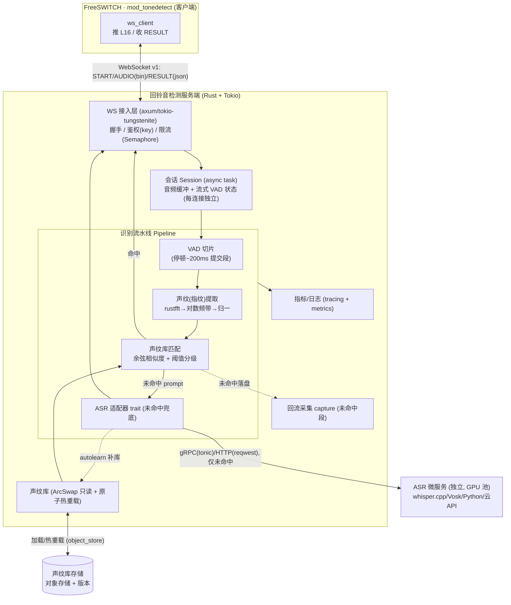
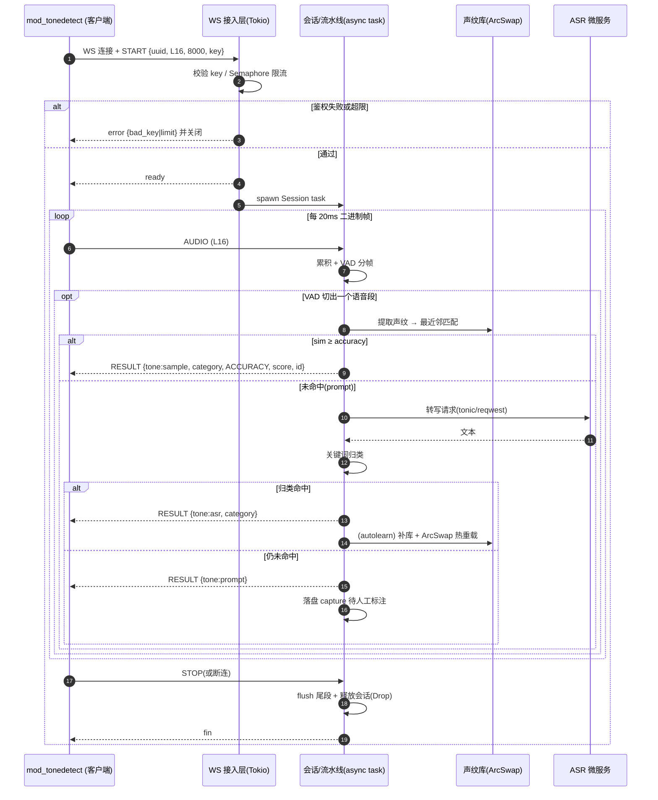
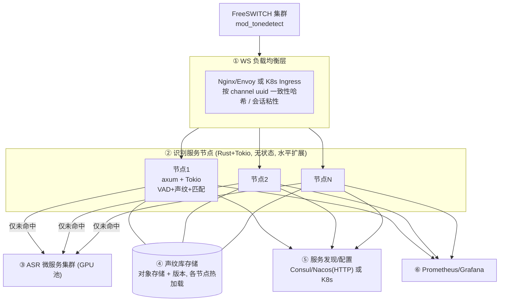
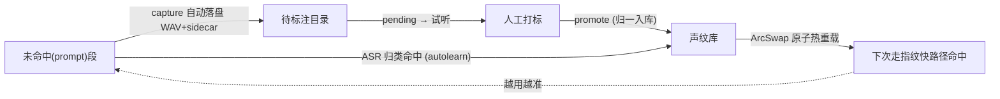

# 回铃音检测平台 — 服务端建设方案(Rust 版)

> 本文是服务端建设方案的 **Rust 技术栈版本**,与 [Java 版](./回铃音检测平台-服务端建设方案-Java版.md) 结构一一对应;两版**架构、协议契约、算法原理完全相同**,差异仅在语言/框架选型与运行特性。
> 场景范围:**仅实时**。配套:[`docs/INTEGRATION.md`](./INTEGRATION.md)(协议契约)、[`docs/ACCURACY.md`](./ACCURACY.md)、`server/`(现有 Python 参考实现,作算法对拍基线)。
> **§10 给出 Java 版与 Rust 版的优缺点对比**,供选型决策。

> **术语对齐**:"声纹库 / 声纹匹配"= 工程上的"音频指纹库 / 指纹匹配"(提示音音色/时频结构匹配,**非说话人声纹识别**)。

---

## 1. 服务端面临的挑战有哪些?

挑战与 Java 版一致(高并发长连接、低延迟、流式有状态、覆盖度/冷启动、ASR 成本、算法移植、热更新、集群粘性、可观测、健壮性、安全)。Rust 视角下的侧重点:

| 类别 | 挑战 | Rust 应对要点 |
|---|---|---|
| **高并发长连接** | 峰值数千~万级并发 WS | Tokio 异步任务:**一连接一 async task**,单核可承载海量连接,内存占用极低 |
| **低延迟 & 稳定** | 实时挂机依赖稳定的秒级响应 | **无 GC**,无停顿抖动,尾延迟(p99)更可控 |
| **流式有状态** | 20ms 帧连续累积 + VAD 切片 | 每连接独立 `Session` 状态,所有权模型天然隔离 |
| **算法移植** | 无 numpy,需自实现 DSP/指纹 | `rustfft` + `ndarray`,与 Python 实现对拍 |
| **ASR 成本/延迟** | ASR 吃 GPU、延迟高 | ASR 拆独立微服务;或 `whisper-rs` 内嵌 whisper.cpp |
| **热更新** | 新增样本不停服 | `ArcSwap` 原子热重载声纹库,读侧无锁 |
| **集群/LB** | 长连接需会话粘性 | 按 `uuid` 一致性哈希(外部 LB / K8s) |
| **可观测** | 量化耗时/命中率/状态分布 | `tracing` + `metrics` + Prometheus exporter |
| **生态短板** | Spring Cloud 类一体化生态缺失 | 用 Nacos/Consul HTTP SDK 或 K8s 原生服务发现(见 §5/§10) |

---

## 2. 服务端与客户端约定的对接方式与接口文档

协议与字段**与语言无关**,与 Java 版完全相同。摘要:WebSocket 长连接,**二进制帧上行 L16 音频、文本帧(JSON)收发控制/结果**;音频 L16/8kHz/单声道/小端 16-bit,20ms 一帧。

- 消息流:`START`(C→S,首帧+鉴权)→ `ready`/`error`(S→C)→ `AUDIO`(C→S 二进制)→ `RESULT`(S→C,可多条)→ `STOP`(C→S)/`FIN`(S→C)。
- `RESULT.accuracy` 仅 `ACCURACY` 触发上报/挂机;号码状态标准表 id 2-20。

> **全部字段的完整清单**直接复用 Java 版 [附录 A:接口字段完整版](./回铃音检测平台-服务端建设方案-Java版.md#附录-a接口字段完整版)(协议同版本 v1,跨语言一致),权威来源 [`docs/INTEGRATION.md`](./INTEGRATION.md)。

Rust 侧实现要点:
- 用 `serde` / `serde_json` 反序列化 `START`、序列化 `RESULT`;用 `#[serde(tag = "type")]` 区分消息类型。
- 二进制帧:`Message::Binary(bytes)` 按小端 `i16` 解释(`bytemuck` 或手动 `from_le_bytes`),按帧累积。
- 鉴权失败/超限返回 `error` 后关闭连接。

---

## 3. 服务端技术架构交互图



---

## 4. 服务端技术架构时序图



---

## 5. 各技术栈的优缺点

### 5.1 总体选型(Rust)

| 层 | 选型 | 优点 | 缺点 |
|---|---|---|---|
| **运行时** | Rust + **Tokio**(异步) | 无 GC、内存安全、零成本抽象;一连接一 task,资源占用极低 | 学习曲线陡;async 生命周期/`Send+Sync` 复杂 |
| **Web/WS 框架** | **axum**(基于 hyper/tower)或 `tokio-tungstenite` | 高性能、生态活跃、中间件(tower)丰富 | 不如 Spring 一体化;脚手架需自搭 |
| **JSON** | serde / serde_json | 极快、零拷贝友好、编译期检查 | — |
| **FFT/DSP** | **rustfft** + realfft + ndarray | 高性能纯 Rust FFT,无外部依赖 | 需自己组装指纹流水线 |
| **音频** | hound(WAV) | 简单可靠 | 重采样等需自写 |
| **ASR** | trait 适配:`whisper-rs`(whisper.cpp)/ `vosk` / 远程微服务(tonic/reqwest) | 可内嵌 whisper.cpp、可私有化 | 本地中文电话域需调优;ML 生态弱于 Python |
| **可观测** | tracing + metrics + metrics-exporter-prometheus | 结构化、低开销 | 生态较 Micrometer 年轻 |
| **配置/发现** | config/figment;Nacos/Consul HTTP SDK 或 K8s | 灵活 | **无 Spring Cloud 级一体化**(关键短板,见 §10) |
| **构建/部署** | Cargo + 多阶段 Docker(distroless/scratch) | **镜像极小**、启动极快、单静态二进制 | 编译慢;交叉编译需配置 |

### 5.2 并发模型(Rust)

| 方案 | 模型 | 单机连接 | 复杂度 | 适用 |
|---|---|---|---|---|
| **Tokio async + 一连接一 task** | 协作式异步 | **极高(万级+)** | 中(async 心智) | **主推** |
| 同步线程池 | 阻塞 | 中 | 低 | 不推荐(连接多时浪费线程) |

> 结论:Rust 用 **Tokio async**,以极低内存/CPU 承载海量并发连接,且无 GC 停顿,尾延迟稳定。

---

## 6. 服务端集群分层架构

集群形态与 Java 版相同:**无共享、可水平扩展的扇出型**,不需要分布式 Session / Redis Pub-Sub / 消息 broker。



| 层 | 职责 | Rust 侧选型 |
|---|---|---|
| ① 负载均衡 | WS 路由、会话粘性、鉴权/限流 | **Nginx/Envoy / K8s Ingress**(Rust 无 Spring Cloud Gateway 等价物,首选成熟外部 LB) |
| ② 识别节点 | 无状态,各自处理本机连接 | Rust + axum + Tokio |
| ③ ASR 微服务 | 重算力,独立扩缩容 | 见 §9 |
| ④ 声纹库 | 只读 + 版本,各节点加载/热重载 | 对象存储(`object_store`/`aws-sdk-s3`) |
| ⑤ 注册/配置 | 服务发现、动态配置 | Consul / Nacos(HTTP SDK)/ K8s 原生 |
| ⑥ 可观测 | 指标/日志/告警 | metrics + Prometheus exporter + Grafana |

**路由策略**:同 Java 版——长连接禁用轮询,按 `uuid` **一致性哈希**,保证均匀且扩缩容时迁移最小。

> 与 Java 版差异:Rust 没有 Spring Cloud Gateway 这种"框架内置 WS 网关 + 全家桶",集群的网关/发现更依赖 **外部基础设施(Nginx/Envoy/K8s/Consul)**。若团队已是 K8s 体系,这反而更轻、更标准化。

---

## 7. 声纹库与声纹匹配的算法原理

**算法与 Java 版、Python 参考实现完全一致**(跨语言对拍同一结果)。`server/tonedetect_server/fingerprint.py`、`server/tonedetect_server/matcher.py`

### 7.1 声纹(指纹)提取流水线
```
一段语音 PCM
  → 分帧加窗(32ms 窗 / 16ms 跳,汉宁窗)
  → FFT 功率谱(rustfft/realfft)
  → 电话频带(200–3400Hz)聚合为 16 个对数频带能量(log1p)
  → 3 帧时间平滑(抑噪)
  → 逐帧去均值(增益/音量无关)
  → 时间轴线性重采样到固定 32 帧(不同时长可比)
  → 展平 + L2 归一化 → 定长声纹向量
```

### 7.2 声纹匹配与判级
```
查询声纹 fp → 与库内每条样本求余弦相似度(L2 归一向量点积)→ 取最近邻 best_score
  best_score ≥ accuracy(默认 0.75)   → ACCURACY  (命中, tone=sample)
  best_score ≥ inaccuracy(默认 0.60)  → INACCURACY(候选, 可交叉校验)
  否则                                  → LOOSE     (未命中 prompt)
```
- 仅 `ACCURACY` 触发上报/挂机;`INACCURACY` 可用 ASR 复核升级。
- 多变体提升覆盖;阈值可调("准"调高 accuracy,"全"调低 inaccuracy + ASR 兜底)。

### 7.3 Rust 实现注意
- FFT 用 `rustfft`/`realfft`(实数输入更快);向量运算用 `ndarray` 或切片循环(编译优化后接近 C)。
- **与 Python 实现对拍**:同一 WAV 两端 `score` 应一致(从 `server/tests` 迁移用例)。`server/tests`
- 可用 SIMD(`std::simd` / `wide`)进一步加速点积与频带聚合。

---

## 8. 声纹库的管理机制

库结构与操作**与 Java 版一致**(对齐现有 `sampletool`):`samples.json` 索引 + 8kHz/16bit 单声道 WAV,加载时预计算声纹常驻内存。`server/tonedetect_server/matcher.py`、`server/tonedetect_server/library.py`

```json
[ { "file":"konghao_yidong.wav", "name":"konghao_yidong",
    "alias":"does not exist", "category":"空号", "id":3 } ]
```

| 操作 | 说明 |
|---|---|
| add / list / remove | 入库(转 8k 单声道、按标准表归一 `alias/category` 写 `id`、同名覆盖)/ 列表 / 删除 |
| promote / pending | 回流录音正式入库(清理 sidecar)/ 查看待标注 |

### 8.1 采集闭环(冷启动 → 高准确率)


### 8.2 热重载与版本(Rust 实现)
- **原子热重载**:用 `arc_swap::ArcSwap<Library>` 整体替换,读侧无锁、零停顿;后台任务监听对象存储版本变化触发重载。
- **版本管理**:声纹库随对象存储版本化,集群各节点拉同一版本,支持灰度与回滚。
- **归一约束**:统一 8k 单声道 + 标准状态表,保证库内一致与跨节点可比。

### 8.3 存储与索引选型(当前规模:数百条)

> 选型口径与 [Java 版 §8.5](./回铃音检测平台-服务端建设方案-Java版.md#85-存储与索引选型当前规模数百条) 一致:数百条规模**不上向量库/ANN/关系库**,用"目录 WAV + `samples.json` + 内存暴力余弦"(即 §11.3 的 `LinearIndex`)。

- **音频**:目录 + WAV(8k/16bit 单声道);**元数据**:`samples.json`;**向量**:启动重算(几百段 < 1s),可选缓存 `.parquet`。
- **索引**:库指纹堆成 `ndarray` 矩阵,暴力余弦(可 SIMD),数百条亚毫秒、精确。
- **版本/备份**:git 或对象存储版本管理 `samples/` 目录。
- **升级触发**:样本 ≈ 1 万条以上再切 `hnsw_rs`(HNSW),主链路与协议不变。

---

## 9. 如何集成或引入外部的 ASR 能力

ASR 是**未命中兜底**,不进主链路。集成原则同 Java 版:**可插拔 trait + 仅兜底调用 + 建议拆独立微服务**。

```rust
// 适配器接口(示意)
trait AsrEngine: Send + Sync {
    fn transcribe(&self, pcm: &[i16], rate: u32) -> anyhow::Result<String>;
}
```

| 方式 | 代表 | 优点 | 缺点 |
|---|---|---|---|
| **内嵌 whisper.cpp** | `whisper-rs` | JVM 不可比的"进程内 + 原生"集成,私有化 | 需自管模型/GPU,中文电话域需调优 |
| **本地绑定** | `vosk` crate | 私有化、轻量 | 准确率需调优 |
| **独立 Python 微服务** | faster-whisper/FunASR + tonic/HTTP | **ASR 生态最强**、独立扩缩容、与 Rust 解耦 | 多一跳网络 |
| **商业云 API** | 云 ASR | 免运维、开箱准 | 数据出域需合规、按量计费 |

> 推荐:**Rust 识别节点 + 独立 Python/GPU ASR 微服务**(发挥各自所长);强私有化/极致一体化可用 `whisper-rs` 内嵌(Rust 相比 Java 在原生内嵌上更有优势)。

**归类与自学习**(同 Java 版):转写文本按标准表 `states.py` 关键词归类(先具体后宽泛),命中返回 `tone=asr`;可 autolearn 自动补库热重载;`INACCURACY` 用 ASR 交叉校验升级。`server/tonedetect_server/asr.py`、`server/tonedetect_server/states.py`

---

## 10. Java 版 vs Rust 版 优缺点对比

### 10.1 总览

| 维度 | Java 版(Java 21 + Spring Boot 3) | Rust 版(Rust + Tokio + axum) |
|---|---|---|
| **并发模型** | 虚拟线程,一连接一(虚拟)线程,阻塞式 | async task,一连接一 task,协作式 |
| **并发能力** | 高(千~万级) | **极高(万级+,单连接开销更低)** |
| **延迟/抖动** | 低,但有 GC 停顿(ZGC 已极小) | **更低更稳,无 GC,p99 尾延迟可控** |
| **内存占用** | 较高(JVM + 堆) | **低(无运行时 GC,占用小)** |
| **启动速度** | 较慢(JVM 预热;Native 可缓解) | **极快(原生二进制)** |
| **镜像体积** | 较大(JRE) | **极小(distroless/scratch 静态二进制)** |
| **开发效率** | **高**(生态全、心智简单) | 较低(所有权/生命周期/async 学习曲线陡) |
| **生态/框架** | **极丰富**,企业级全家桶 | 活跃但偏年轻,部分领域需自搭 |
| **Spring Cloud 友好** | **原生友好**(Gateway/Nacos/Config/LoadBalancer) | **不友好**(无等价全家桶,依赖外部 LB/K8s/Consul) |
| **ASR 生态** | 中(Vosk/DJL,或拆 Python) | 中(whisper-rs 内嵌优势,或拆 Python) |
| **算法移植** | 需自写 DSP(JTransforms) | 需自写 DSP(rustfft);可 SIMD 更快 |
| **招聘/团队** | **人才多、上手快** | 人才相对少、培养成本高 |
| **运行成本** | 较高(内存/实例规格) | **较低(同等并发更省资源)** |
| **稳定性保障** | 成熟 APM/调优经验多 | 编译期消除大量内存/并发 bug,但生态工具较少 |

### 10.2 Java 版

- **优点**:开发效率高、生态/框架最全、**Spring Cloud 一体化**(网关/发现/配置/监控开箱)、招聘容易、虚拟线程让高并发代码简单、APM 与调优经验成熟。
- **缺点**:内存占用与实例规格更高、有 GC 停顿(对极致尾延迟敏感时需调 ZGC)、镜像大、启动较慢、单位并发的资源成本更高。

### 10.3 Rust 版

- **优点**:**无 GC、低延迟、低内存、高吞吐**、镜像极小启动极快、内存/并发安全在编译期保证、同等并发**运行成本更低**、可原生内嵌 whisper.cpp。
- **缺点**:**学习曲线陡、开发效率低**、async Rust 复杂、**Spring Cloud 类生态缺失**(集群依赖外部基础设施)、招聘难、部分库较年轻。

### 10.4 选型建议

| 若你… | 倾向 |
|---|---|
| 已有 Java/Spring Cloud 体系、追求快速交付与易招聘 | **Java 版** |
| 追求极致并发/低延迟/低成本,且团队具备 Rust 能力或以 K8s 为底座 | **Rust 版** |
| 并发规模中等、迭代速度优先 | **Java 版** |
| 单机连接数要冲极高、对内存/尾延迟敏感、规模化降本 | **Rust 版** |
| ASR 想"进程内原生内嵌"(whisper.cpp) | **Rust 版**(`whisper-rs` 更顺) |

> 务实路径:**先用 Java 版快速落地、跑通准确率与业务闭环;当并发规模与成本成为瓶颈,再将"WS 接入 + 声纹热路径"用 Rust 重写、ASR 仍走独立微服务。** 协议契约(协议 v1)保证两版可平滑替换、混合共存。`docs/INTEGRATION.md`

---

## 11. 容量、稳定性与可扩展性(相对 Java 版的差异化说明)

> 目标与口径**与 [Java 版 §10–§13](./回铃音检测平台-服务端建设方案-Java版.md#10-容量规划与-slo) 完全一致**(SLO、延迟预算、fail-open 降级、ASR 隔离、健康检查、热重载灰度、可插拔 Extractor/Index/Matcher 抽象、协议演进与安全),此处仅列 Rust 的实现差异与优势。

### 11.1 容量与性能
- **更高密度**:无 GC + 低单连接开销,**同等内存承载更多并发连接**;`p99` 尾延迟更稳(无 GC 停顿)。
- 指纹批量匹配可用 SIMD(`std::simd`/`wide`)与 `ndarray`/矩阵乘加速;线性小库延迟可忽略。

### 11.2 稳定性与容错(Rust 实现)
- **超时**:`tokio::time::timeout` 包裹 ASR 调用。
- **熔断/隔离舱**:用 `tower` 中间件(`tower::limit`、自定义 `Layer`)或 `Semaphore` 实现限流/熔断/bulkhead;ASR 故障短路走 `prompt`。
- **过载**:`Semaphore` 控全局并发,超限回 `error.reason=limit`。
- **健康检查/优雅启停**:axum 暴露 `/healthz` `/readyz`;`tokio::signal` 捕获信号 → 停止接新连接 → drain 现有连接(`CancellationToken`)→ 退出。
- **热重载**:`arc_swap::ArcSwap<Library>` 原子换库,进行中匹配持旧 `Guard` 跑完。

### 11.3 可扩展抽象 + ANN(Rust 实现)
- `trait FeatureExtractor / Index / Matcher`(`dyn` 或泛型);`Index` 实现:`LinearIndex` / `hnsw_rs`(HNSW)/ `faiss` 绑定(IVF-PQ)。
- 深度嵌入用 `candle` / `ort`(ONNX Runtime)/ `tch` 推理;模型经 ONNX 跨语言复用。
- 演进路径同 Java 版:`Fingerprint+Linear → HNSW → Embedding`,不改对外协议。

### 11.4 安全
- TLS 用 `rustls`(`wss`);输入加固(帧大小上限、START 校验、空闲超时)在 axum/tungstenite 层处理。

---

## 附:相关文档索引

| 文档 | 内容 |
|---|---|
| [`docs/回铃音检测平台-服务端建设方案-Java版.md`](./回铃音检测平台-服务端建设方案-Java版.md) | 服务端建设方案 **Java 版**(含接口字段完整版附录 A) |
| [`docs/回铃音检测平台-服务端建设方案-Python版.md`](./回铃音检测平台-服务端建设方案-Python版.md) | 服务端建设方案 **Python 版**(复用现有 `server/`,含 Java vs Python 对比) |
| [`docs/回铃音检测-技术方案沟通.md`](./回铃音检测-技术方案沟通.md) | 总体技术方案沟通(工程实现版) |
| [`docs/INTEGRATION.md`](./INTEGRATION.md) | WebSocket 协议 v1、对接契约、状态对照表(id 2-20)、FreeSWITCH 侧对接 |
| [`docs/ACCURACY.md`](./ACCURACY.md) | 识别全部号码状态与提升准确率指南 |
| [`server/README.md`](../server/README.md) | 现有 Python 参考实现(算法对拍基线) |
