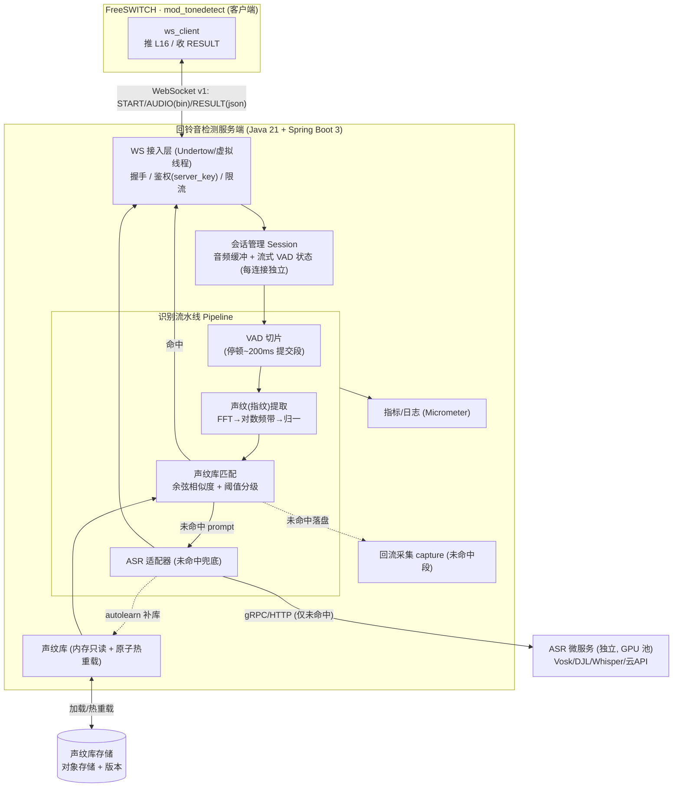
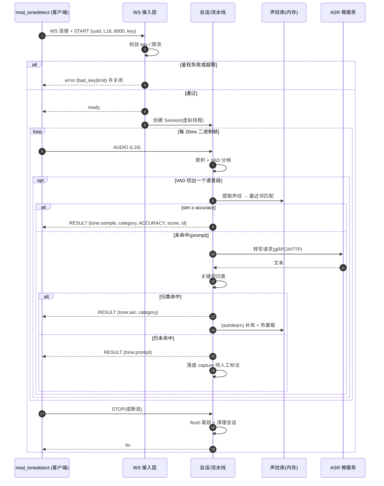
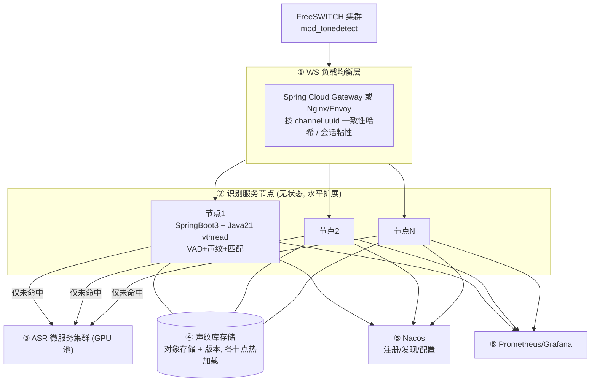
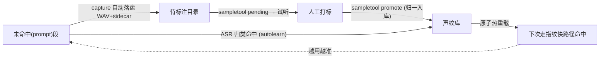

# 回铃音检测平台 — 服务端建设方案

> 本文聚焦**服务端(识别平台)**的建设:挑战、对接契约、技术架构、集群分层、声纹(音频指纹)算法与库管理、外部 ASR 引入。
> 场景范围:**仅实时**(通话中识别,可即时挂机/重路由);准实时与数分不在范围内。
> 技术选型:**Java 21 + Spring Boot 3**(详见 §5)。配套:[`docs/INTEGRATION.md`](./INTEGRATION.md)(协议契约)、[`docs/ACCURACY.md`](./ACCURACY.md)、`server/`(现有 Python 参考实现,作算法对拍基线)。

> **术语对齐**:本文"**声纹库 / 声纹匹配**"即工程上的"**音频指纹库 / 指纹匹配**"——对早期媒体语音提示音提取声学指纹并比对,**非说话人声纹识别(speaker recognition)**,而是"提示音音色/时频结构"的匹配。

---

## 1. 服务端面临的挑战有哪些?

| 类别 | 挑战 | 影响 / 应对要点 |
|---|---|---|
| **高并发长连接** | 每条 call leg 一条 WebSocket,外呼峰值数千~万级并发连接 | 连接模型必须可横向扩展;Java 21 **虚拟线程**一连接一线程即可扛量(§5/§6) |
| **低延迟** | 实时挂机价值依赖秒级出结果,任何排队/抖动都会拖慢 | `TCP_NODELAY`、逐帧 flush、识别流水线轻量化;ASR 只兜底不进主路径 |
| **流式有状态** | 音频是 20ms 一帧的连续流,需跨帧累积 + VAD 切片 | 每连接维护独立会话状态(缓冲 + VAD),连接间无共享 |
| **准确率/覆盖度** | 声纹库覆盖度=准确率,运营商/地区/措辞差异大 | 多变体样本 + 阈值分级 + ASR 兜底 + 自学习补库(§7/§8/§9) |
| **冷启动** | 初期声纹库为空,命中率低 | 边跑边采回流 + 人工打标 + ASR 自学习扩库(见 `docs/ACCURACY.md`) |
| **ASR 成本/延迟** | ASR 吃 GPU、有延迟,在线大并发压力大 | ASR 拆为**独立微服务**,仅未命中时调用(§9) |
| **算法移植** | Java 无 numpy,DSP/指纹需自实现 | 用 FFT 库(JTransforms)一比一移植,并与 Python 实现对拍(§5/§7) |
| **热更新** | 新增样本不能停服 | 声纹库**原子热重载**(§8) |
| **集群与负载均衡** | 长连接不能轮询,需会话粘性 | 按 channel `uuid` **一致性哈希**路由(§6) |
| **可观测性** | 需量化识别耗时/命中率/状态分布 | Micrometer + Prometheus + 结构化日志 |
| **健壮性** | 半包/乱序/异常断连/客户端随时关闭 | 连接级隔离,单连接异常不影响他人;优雅清理会话 |
| **安全** | 鉴权、限流、私有化数据不出域 | `server_key` 校验、并发信号量限流、(用开源 ASR)数据不出域 |

---

## 2. 服务端与客户端约定的对接方式与接口文档

**完整契约见 [`docs/INTEGRATION.md`](./INTEGRATION.md)**,此处摘要服务端需实现的协议 v1。

- **传输**:WebSocket 长连接,每条 call leg 一条。**音频上行=二进制帧,控制/结果=文本帧(JSON)**。
- **音频规格**:L16 / 8kHz / 单声道 / 小端 16-bit PCM,建议 20ms 一帧(160 样本 / 320 字节)。
- **URL**:`ws://host:port/`(内网)/ `wss://`(公网)。

### 2.1 消息流

| 方向 | 消息 | 类型 | 说明 |
|---|---|---|---|
| C→S | `START` | 文本/JSON | 连接后**第一条**,声明媒体参数 + 鉴权 |
| S→C | `ready` / `error` | 文本/JSON | 握手结果 |
| C→S | `AUDIO` | **二进制** | 连续 L16 PCM 帧 |
| S→C | `RESULT` | 文本/JSON | 每识别出一个语音段推一条(可多次) |
| C→S | `STOP` | 文本/JSON | 结束(或直接关连接) |
| S→C | `FIN` | 文本/JSON | 关闭前可发 |

### 2.2 START(client → server)

```json
{ "type":"start", "version":1, "uuid":"<channel-uuid>",
  "codec":"L16", "samplerate":8000, "key":"<auth-key>",
  "params":{ "stoptone":"busy silence", "maxdetecttime":60 } }
```

服务端校验 `key` 通过回 `{"type":"ready"}`,否则 `{"type":"error","reason":"bad_key"}` 并关闭。

### 2.3 RESULT(server → client)

```json
{ "type":"result", "tone":"sample", "category":"空号",
  "alias":"does not exist", "name":"konghao_yidong",
  "accuracy":"ACCURACY", "score":0.93, "id":3,
  "point_begin":1200, "point_end":2600 }
```

| 字段 | 说明 |
|---|---|
| `tone` | `sample`(命中声纹库)/ `asr`(ASR 归类)/ `prompt`(有语音未识别)/ `silence` |
| `accuracy` | `ACCURACY`/`INACCURACY`/`LOOSE` —— **仅 `ACCURACY` 应触发上报/挂机** |
| `score` | 与最佳样本相似度 0..1(指纹路径) |
| `category`/`alias`/`id` | 号码状态(中文/英文/编号,见标准表 id 2-20) |
| `name` | 命中样本名(仅 `tone=sample`);`text` 为 ASR 转写(仅 `tone=asr`) |
| `point_begin`/`point_end` | 语音段在流中的毫秒位置 |

### 2.4 错误码 / 行为契约

- `error.reason`:`bad_key`(鉴权失败)/ `bad_json`(控制帧非法)/ `limit`(并发超限,客户端优雅降级)。
- **最小行为契约**(任意语言实现):接受连接 → 收 `START` 校验回 `ready` → 累积二进制帧按 START 采样率解释 → VAD/识别 → 每结论推 `RESULT`(**只有把握高才用 `ACCURACY`**)→ 收 `STOP`/断连即停。`docs/INTEGRATION.md`
- **号码状态标准表(id 2-20)** 为单一来源,服务端归一引用。`server/tonedetect_server/states.py`

---

## 3. 服务端技术架构交互图



**要点**:接入层 → 会话 → 流水线分层清晰;**重算力(ASR)拆独立微服务**,主链路只跑轻量 DSP/指纹;声纹库内存只读、原子热重载。

---

## 4. 服务端技术架构时序图



---

## 5. 各技术栈的优缺点

### 5.1 总体选型(已定:Java 21 + Spring Boot 3 + 虚拟线程)

| 层 | 选型 | 优点 | 缺点 |
|---|---|---|---|
| **运行时** | Java 21 LTS(虚拟线程) | 一连接一线程的阻塞式写法即可扛高并发,代码简单;JIT 后 DSP 性能好 | 内存占用高于 Go/Rust;启动较慢(可 GraalVM Native 缓解) |
| **框架** | Spring Boot 3.x | 生态全、监控/配置/MQ 开箱即用、招人易;对 Spring Cloud 友好 | 体量重于 Quarkus/Micronaut |
| **WebSocket** | Spring WebSocket + Undertow | 与 Spring 集成顺、二进制帧支持好 | 极限连接数下不如裸 Netty |
| **JSON** | Jackson | 成熟稳定 | — |
| **FFT/DSP** | JTransforms(或 Commons Math) | 纯 Java、快;无外部依赖 | 需自己组装指纹流水线(无 numpy) |
| **音频** | `javax.sound.sampled` | JDK 自带读 WAV | 8k 重采样等需自写 |
| **ASR** | 适配器:Vosk(本地 Java 绑定)/ DJL(Whisper)/ 远程微服务 | 可插拔、可私有化 | 本地中文电话域质量需调优;GPU 运维成本 |
| **可观测** | Micrometer + Prometheus + Logback | 标准、生态好 | — |
| **构建/部署** | Maven + Docker(可选 GraalVM Native) | 企业常见、CI 成熟 | Native 编译有约束 |

### 5.2 并发模型对比(关键决策)

| 方案 | 模型 | 单机连接 | 开发复杂度 | Spring Cloud 友好 | 适用 |
|---|---|---|---|---|---|
| **Java 21 虚拟线程 + Spring WebSocket** | 一连接一虚拟线程,阻塞式 | 高(千~万) | **低** | 高 | **主推** |
| Spring WebFlux + Reactor Netty | 事件驱动/响应式 | 很高 | 中~高 | 高(Gateway 同栈) | 极致并发/纯网关 |
| 裸 Netty | 事件驱动,手控 ByteBuf | 最高 | 高 | 中 | 极限性能/自定义协议 |

> 结论:识别节点用**虚拟线程**最简单够用;**Spring Cloud Gateway 底层即 Netty**,网关层自然拥有 Netty 能力,无需在节点里裸写 Netty。

---

## 6. 服务端集群分层架构

回铃音检测集群是**"无共享、可水平扩展的扇出型"**:连接相互独立、无跨连接广播,**不需要分布式 Session / Redis Pub-Sub / 消息 broker**。重点只在"单机扛多少连接"与"连接如何均匀分布"。



| 层 | 职责 | 选型 |
|---|---|---|
| ① 负载均衡 | WS 路由、会话粘性、统一鉴权/限流 | Spring Cloud Gateway(Spring 生态)或 Nginx/Envoy |
| ② 识别节点 | 无状态,各自处理本机连接 | Spring Boot 3 + 虚拟线程 |
| ③ ASR 微服务 | 重算力,独立扩缩容 | 见 §9 |
| ④ 声纹库 | 只读 + 版本,各节点加载/热重载 | 对象存储(S3/MinIO) |
| ⑤ 注册/配置 | 服务发现、动态配置 | Nacos / Eureka |
| ⑥ 可观测 | 指标/日志/告警 | Micrometer + Prometheus + Grafana |

**路由策略**:长连接**禁用轮询**,按 FreeSWITCH `uuid` 做**一致性哈希**(`START` 携带 uuid),保证均匀分布且扩缩容时重哈希迁移最小(已建连接不受影响)。`docs/INTEGRATION.md`

---

## 7. 声纹库与声纹匹配的算法原理

> 即"音频指纹库 + 指纹匹配"。原理与现有 Python 实现一致,Java 侧一比一移植并对拍。`server/tonedetect_server/fingerprint.py`、`server/tonedetect_server/matcher.py`

### 7.1 声纹(指纹)提取流水线

```
一段语音 PCM
  → 分帧加窗(32ms 窗 / 16ms 跳,汉宁窗)
  → FFT 功率谱
  → 电话频带(200–3400Hz)聚合为 16 个对数频带能量(log1p 压缩)
  → 3 帧时间平滑(抑制加性噪声)
  → 逐帧去均值(增益/音量无关)
  → 时间轴线性重采样到固定 32 帧(不同时长可比)
  → 展平 + L2 归一化 → 定长声纹向量
```

设计意图:
- **对数频带 + 去均值** → 对音量/增益变化不敏感;
- **时间平滑** → 抗轻度噪声;
- **时间归一** → 容忍不同语速/时长;
- 仍**保留时频结构**,可区分"已关机"/"是空号"等不同提示音。

### 7.2 声纹匹配与判级

```
查询段声纹 fp
  → 与库内每条样本声纹求余弦相似度(= L2 归一向量点积)
  → 取最近邻 best, best_score
  → best_score ≥ accuracy(默认 0.75)        → ACCURACY  (命中, tone=sample)
    best_score ≥ inaccuracy(默认 0.60)       → INACCURACY(候选, 可交叉校验)
    否则                                       → LOOSE     (视为未命中 prompt)
```

- **仅 `ACCURACY`** 才触发上报/挂机;`INACCURACY` 可用 ASR 复核,一致则升级(降误判)。`docs/ACCURACY.md`
- **多变体提升覆盖**:同一 `category/alias` 收多条 `name`(多运营商/地区/措辞),最近邻取最高分。
- **阈值可调**:追求"准"调高 `accuracy`,追求"全"调低 `inaccuracy` + 开 ASR 兜底。

### 7.3 Java 移植注意

- FFT 用 JTransforms;频带边界用对数刻度 `logspace(200,3400,17)`;向量运算自写或用数组循环(JIT 后够快)。
- **务必与 Python 实现对拍**:同一 WAV 在两端产出的 `score` 应一致(单测用例从 `server/tests` 迁移)。`server/tests`

---

## 8. 声纹库的管理机制

### 8.1 库结构

声纹库 = 一个目录 + `samples.json` 索引 + 若干 8kHz/16bit 单声道 WAV:

```json
[ { "file":"konghao_yidong.wav", "name":"konghao_yidong",
    "alias":"does not exist", "category":"空号", "id":3 } ]
```

加载时为每条样本**预计算声纹**,常驻内存供匹配。`server/tonedetect_server/matcher.py`

### 8.2 管理操作(对齐现有 `sampletool`)

| 操作 | 说明 |
|---|---|
| **add** | 入库一个 WAV:自动转 8k 单声道、按标准表归一 `alias/category` 并写 `id`,同名覆盖 |
| **list** | 列出库内样本 |
| **remove** | 删除样本及其 WAV |
| **promote** | 把回流目录中一条未命中录音正式入库,并清理其 sidecar |
| **pending** | 查看待标注的回流录音 |

入库时 `alias/category` 经 `states.normalize()` 归一(给其一补全另一并写 `id`),避免标签发散;`strict` 模式拒绝非标准状态。`server/tonedetect_server/library.py`、`server/tonedetect_server/states.py`

### 8.3 采集闭环(冷启动 → 高准确率)



来源:① 服务端自动回流(未命中段)② mod 侧 `recordpath` 录全段供裁剪。详见 `docs/ACCURACY.md`、`server/README.md`。

### 8.4 热重载与版本

- **原子热重载**:新库加载为不可变结构,`AtomicReference` 整体替换,读侧无锁、不停服。
- **版本管理**:声纹库随对象存储版本化,支持灰度切换与回滚;集群各节点拉取同一版本,保证一致。
- **归一约束**:统一 8k 单声道、统一标准状态表,保证库内一致与跨节点可比。`server/tonedetect_server/library.py`

---

## 9. 如何集成或引入外部的 ASR 能力

ASR 是**样本库未命中时的兜底**,覆盖尚未收录的措辞,**不进主链路**。`server/tonedetect_server/asr.py`

### 9.1 集成原则

- **可插拔适配器**:定义统一接口 `transcribe(short[] pcm, int rate) -> text`,实现可换(本地/远程/云)。对应现有 `create_asr()` 工厂。`server/tonedetect_server/asr.py`
- **仅兜底调用**:只有指纹匹配为 `prompt`(或 `INACCURACY` 需复核)时才调 ASR,控制成本与延迟。
- **强烈建议拆独立微服务**:ASR 吃 GPU、延迟高,独立部署 + 独立扩缩容,识别节点经 gRPC/HTTP 调用(§3/§6)。

### 9.2 引擎选项

| 方式 | 代表 | 优点 | 缺点 |
|---|---|---|---|
| **本地 Java 绑定** | Vosk(原生 Java API) | 私有化、JVM 内直调、无跨进程 | 中文电话域准确率需调优 |
| **JVM 跑模型** | DJL(加载 Whisper/PyTorch) | 留在 JVM、模型可换 | 需 GPU、内存大 |
| **独立 Python 微服务** | faster-whisper / FunASR + gRPC | **ASR 生态最强**、独立扩缩容、与 Java 解耦 | 多一跳网络 |
| **商业云 API** | 云厂商 ASR | 免运维、开箱准 | 数据出域需合规、按量计费 |

> 推荐:**Java 识别节点 + 独立 Python/GPU ASR 微服务(faster-whisper/FunASR)**——发挥 Java 高并发与 Python ASR 生态各自所长,契合"ASR 仅兜底"的设计。强私有化诉求可用 Vosk 本地绑定起步。

### 9.3 转写后归类与自学习

- **关键词/语义归类**:转写文本按标准表 `states.py` 的 `keywords` 映射到号码状态(先具体后宽泛,"稍后再拨"放最末避免误判),命中即返回 `tone=asr`。`server/tonedetect_server/asr.py`、`server/tonedetect_server/states.py`
- **自学习(autolearn)**:ASR 归类命中的段可**自动补入声纹库并热重载**,使下次走更快更准的指纹路径——系统越用越准。`docs/ACCURACY.md`
- **交叉校验**:指纹候选为 `INACCURACY` 时用 ASR 复核,一致则升 `ACCURACY`(`confirmed_by=asr`),降低误判。

---

## 附:相关文档索引

| 文档 | 内容 |
|---|---|
| [`docs/INTEGRATION.md`](./INTEGRATION.md) | WebSocket 协议 v1、对接契约、状态对照表(id 2-20)、FreeSWITCH 侧对接 |
| [`docs/ACCURACY.md`](./ACCURACY.md) | 识别全部号码状态与提升准确率指南 |
| [`docs/回铃音检测-技术方案沟通.md`](./回铃音检测-技术方案沟通.md) | 总体技术方案沟通(工程实现版) |
| [`server/README.md`](../server/README.md) | 现有 Python 参考实现(算法对拍基线) |
