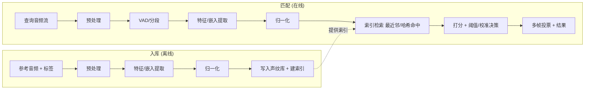

# 声纹库与声纹匹配 — 算法实现原理(技术文档)

> 本文是**通用算法技术文档**,系统梳理"声纹库 + 声纹匹配"的主流与前沿技术、实现原理、关键数据结构与算法,以及 Java / Rust / Python 的实现取舍。
> **不绑定任何现有实现**,面向选型与设计参考。

> **术语与范围**:本文"声纹"取**广义**——指"把一段音频压成可比较的特征表示(指纹 / 嵌入向量 / 哈希),再在库中检索匹配"。它涵盖三个相关但不同的方向:
> 1. **音频指纹(audio fingerprinting)**:识别"同一段音频/提示音"(Shazam、回铃提示音匹配)。
> 2. **说话人声纹(speaker recognition)**:识别"谁在说"(x-vector / ECAPA)。
> 3. **音频表示学习(audio embedding)**:通用音频语义向量(CLAP / WavLM)。
> 三者在"特征 → 向量 → 检索"的范式上高度一致,本文统一讨论,并在差异处分别说明。

---

## 1. 目前主流的技术方案有哪些?各自优缺点

按"特征如何得到 + 如何比对"分为五大类:

### 1.1 谱峰星座/地标哈希(Shazam 式)
对频谱图取局部峰值(constellation),把峰值对编码成哈希,存入倒排表;查询时哈希命中 + 时间一致性投票。

- **优点**:对噪声/失真极鲁棒;**亚线性检索**(哈希表);适合海量曲库精确"同源"识别。
- **缺点**:识别"完全相同录音",**对同义不同录的提示音泛化弱**;需大量样本;实现较复杂。

### 1.2 鲁棒比特指纹(Philips/Haitsma、Chromaprint)
逐帧把频带能量差编码成 0/1,得到比特流指纹;用**汉明距离**比对。

- **优点**:紧凑(每帧几十 bit)、比对快、抗轻度失真;Chromaprint/AcoustID 工业验证。
- **缺点**:仍偏"同源识别";对强变体/不同 TTS 措辞泛化有限。

### 1.3 声学特征向量 + 距离(MFCC / log-mel 频带能量 + 余弦/DTW)
提取 MFCC 或对数梅尔频带能量,做归一化得到定长/变长特征,用**余弦相似度**(定长)或 **DTW**(变长对齐)比对。

- **优点**:实现简单、CPU 省、可解释、**加样本即扩展、无需训练**;对提示音这类"短而结构化"的音频效果好。
- **缺点**:覆盖度=样本库覆盖度;对完全没见过的措辞需先补样本;判别力弱于深度嵌入。

### 1.4 经典统计模型(GMM-UBM / i-vector + PLDA)
说话人识别的经典范式:用通用背景模型(UBM)+ 因子分析得到 i-vector,用 PLDA 打分。

- **优点**:小数据下稳健、理论成熟、是深度方法的前身。
- **缺点**:已被深度嵌入超越;流程复杂、训练成本高;对短音频敏感。

### 1.5 深度嵌入(d-vector / x-vector / ECAPA-TDNN / 自监督编码器)
用神经网络把音频映射成判别性嵌入向量(embedding),再用余弦/PLDA 比对;近年以 **ECAPA-TDNN**(说话人)、**WavLM/HuBERT/Wav2Vec2/CLAP**(通用音频)为代表。

- **优点**:**判别力最强、泛化最好**;一个嵌入器 + 向量检索可支撑大规模;可零样本/少样本。
- **缺点**:**算力大(GPU)**、有延迟、模型与数据依赖;可解释性差;部署运维重。

### 1.6 (旁支)ASR + 文本匹配
把音频转写为文本再做关键词/语义匹配(对"语音提示音"尤其有效)。

- **优点**:对措辞泛化极强、可解释(看转写文本);覆盖样本库未收录的说法。
- **缺点**:依赖 ASR 质量与算力;短促/嘈杂音频转写易错;延迟高。

### 1.7 选型速览

| 方案 | 判别力 | 鲁棒性 | 算力 | 泛化 | 实现复杂度 | 典型场景 |
|---|---|---|---|---|---|---|
| 星座哈希 | 中(同源) | 高 | 低 | 低 | 高 | 海量同源识别(听歌识曲) |
| 比特指纹 | 中(同源) | 中高 | 低 | 低 | 中 | 版权/同源比对 |
| MFCC/频带+余弦/DTW | 中 | 中 | **低** | 中 | **低** | **提示音/短音频匹配** |
| i-vector+PLDA | 中高 | 中 | 中 | 中 | 高 | 经典说话人识别 |
| 深度嵌入 | **高** | **高** | 高(GPU) | **高** | 高 | 大规模/高精度/少样本 |
| ASR+文本 | 高(语义) | 中 | 高 | **高** | 中 | 语音提示音语义归类 |

> 工程常见组合:**轻量特征(频带/MFCC)做主力快路径 + 深度嵌入或 ASR 做兜底/泛化**,兼顾速度、覆盖与成本。

---

## 2. 声纹库与声纹匹配的详细实现过程与原理

整体范式:**入库(enrollment)**离线建库 + **匹配(query)**在线检索,二者共用同一套特征提取。



### 2.1 预处理
- **统一格式**:重采样到固定采样率(电话域常用 8k)、转单声道、幅度归一。
- **(可选)降噪/去直流/预加重**:抑制噪声与低频漂移,提升鲁棒性。

### 2.2 分段(VAD / 切片)
流式场景需把连续音频切成"语音段":能量门限或神经 VAD(WebRTC VAD / Silero),语音后出现停顿即提交一段;给每段打上时间戳。

### 2.3 特征 / 嵌入提取(三选一范式)
- **手工特征**:STFT(分帧加窗 + FFT)→ 梅尔滤波器组 → log → (MFCC 还做 DCT);或对数频带能量。再做时间平滑、逐帧去均值(增益无关)、时间轴归一(变长→定长)。
- **哈希指纹**:从频谱取峰值/能量差,编码为整型哈希或比特串。
- **深度嵌入**:把波形/频谱喂给预训练编码器(ECAPA / WavLM / CLAP),取池化后的定长向量。

### 2.4 归一化
- 向量做 **L2 归一化**(使余弦相似度=点积);或做均值-方差标准化;深度嵌入常配 **PLDA / 长度归一**。

### 2.5 入库(建库)
- 每条参考音频提取特征 → 连同元数据(类别/别名/id/来源)存储 → **建立检索索引**(见 §3.5):
  - 哈希方案 → 倒排表/哈希表;
  - 向量方案 → 暴力矩阵、KD/Ball-Tree(低维)、**ANN(HNSW/IVF-PQ)**(高维大规模)。
- **多变体**:同一标签收录多条样本(多来源/口音/措辞),提升覆盖。

### 2.6 匹配(检索 + 打分 + 决策)
1. **检索**:
   - 哈希:查询哈希在倒排表命中候选 → 时间偏移一致性投票;
   - 向量:在库中取**最近邻**(余弦/欧氏);大库走 ANN。
2. **打分**:相似度分数(余弦、负距离、PLDA 对数似然比)。
3. **校准与阈值**:把原始分映射到可比尺度(score normalization / logistic 校准),用阈值分级(如 高/中/低 置信)。
4. **决策与投票**:
   - 仅高置信才采信(触发动作);
   - 流式可要求**连续多段一致**再确认(提示音常循环播放),降误判;
   - 中置信可用**第二通道复核**(如 ASR 交叉校验)升级。

### 2.7 两个代表性实现细节

**(A)对数频带能量 + 余弦(轻量、可解释)**
```
段 PCM → 32ms 窗/16ms 跳 加汉宁窗 → FFT 功率谱
       → 200–3400Hz 聚合 16 个对数频带能量 → 时间平滑 → 逐帧去均值
       → 时间轴重采样到固定帧数 → 展平 + L2 归一 → 定长向量
匹配:与库内向量求余弦(点积),取最近邻 + 阈值分级
```

**(B)深度嵌入 + ANN(高精度、可扩展)**
```
段波形 → 预训练编码器(ECAPA/WavLM/CLAP) → 池化得 192~1024 维嵌入 → L2 归一
建库:嵌入入 HNSW/IVF-PQ 索引
匹配:查询嵌入在 ANN 索引取 top-k → 余弦/PLDA 打分 → 校准阈值
```

---

## 3. 涉及的关键数据结构与算法

### 3.1 信号处理
- **FFT / STFT**:频谱基础;实数输入用 rFFT 提速。
- **Goertzel**:单/少频点能量检测(比全 FFT 省,适合固定频率如 450Hz)。
- **窗函数**:汉宁/汉明,降频谱泄漏。
- **梅尔滤波器组 + DCT**:MFCC 的核心(感知频率刻度 + 去相关)。
- **预加重 / 去均值 / CMVN**:增益与信道归一。

### 3.2 相似度 / 距离度量
- **余弦相似度**(L2 归一后=点积):定长向量主力。
- **欧氏距离 / 内积**:嵌入检索常用。
- **汉明距离**:比特指纹比对(可用 popcount 加速)。
- **DTW(动态时间规整)**:变长序列对齐(动态规划,O(nm))。
- **互相关(cross-correlation)**:模板对齐/时延估计(可用 FFT 加速)。
- **PLDA 对数似然比**:嵌入打分与校准的统计模型。

### 3.3 检索 / 索引(决定可扩展性)
- **哈希表 / 倒排索引**:星座哈希精确命中,亚线性。
- **KD-Tree / Ball-Tree**:低维精确最近邻(高维退化)。
- **LSH(局部敏感哈希)**:近似最近邻,适合高维。
- **HNSW(分层可导航小世界图)**:当前主流 **ANN**,高召回低延迟。
- **IVF-PQ / OPQ(FAISS)**:倒排 + 乘积量化,**亿级向量**省内存。
- **ScaNN / DiskANN**:谷歌/微软的高性能 ANN(含磁盘扩展)。

### 3.4 流式与并发数据结构
- **环形缓冲(ring buffer)**:流式音频帧累积。
- **滑动窗口 / 状态机**:VAD、cadence 节奏判定。
- **优先队列(堆)**:kNN 取 top-k。
- **位集合(bitset)**:比特指纹存储与快速比对。
- **矩阵(batch)**:把库指纹堆成矩阵,用**单次矩阵乘**批量算相似度(替代逐条循环)。

### 3.5 校准与决策
- **score normalization**:z-norm / t-norm / s-norm,跨样本可比。
- **logistic / Platt 校准**:原始分 → 概率。
- **阈值分级 + 多帧投票**:置信分级与时序一致性确认。
- **量化(PQ / 标量量化 / 二值化)**:压缩嵌入、降存储与检索成本。

### 3.6 数据规模与索引选择速览

| 库规模 | 推荐检索 | 说明 |
|---|---|---|
| 数百~数千 | 暴力矩阵乘 | 最简单,延迟可忽略 |
| 万~百万 | HNSW | 高召回低延迟,内存可控 |
| 千万~亿级 | IVF-PQ / DiskANN | 量化压缩 + 磁盘扩展 |

---

## 4. Java / Rust / Python 实现的各自优缺点

聚焦"实现声纹算法与检索"本身(非整体服务)。

### 4.1 能力对比

| 维度 | Python | Java | Rust |
|---|---|---|---|
| **DSP/数值** | numpy/scipy/librosa(最全) | JTransforms / ND4J(中) | rustfft/ndarray(高性能) |
| **深度嵌入推理** | **torch/onnxruntime(最强)** | DJL/onnxruntime-java(中) | candle/ort/tch(成长中) |
| **ANN 向量检索** | FAISS/hnswlib/ScaNN(最全) | **Lucene HNSW**/JVector(强) | hnsw_rs/faiss 绑定(中) |
| **开发效率** | **最高** | 中 | 较低(所有权/生命周期) |
| **运行性能** | 中(numpy 下沉 C;纯循环慢) | 高(JIT、多线程) | **最高(无 GC、SIMD)** |
| **并发/多核** | 受 GIL,需多进程 | **多核友好(虚拟线程)** | **多核友好(无畏并发)** |
| **内存/部署** | 重(解释器+依赖) | 中(JVM) | **轻(静态二进制、镜像小)** |
| **可移植/嵌入** | 一般 | 一般 | **可内嵌 C/whisper.cpp** |
| **类型安全** | 动态(mypy 兜底) | **静态** | **静态 + 内存安全** |

### 4.2 各自定位
- **Python**:**算法原型、训练、深度嵌入、向量检索生态最全**,迭代最快;**生产 CPU 并行受 GIL**,需多进程;适合"研究 + 中小规模 + ASR/嵌入重的场景"。
- **Java**:**工程稳健、并发多核友好、Lucene HNSW 等成熟检索**;DSP/DL 生态弱于 Python;适合"企业级、与现有 JVM 体系整合、纯检索服务"。
- **Rust**:**性能与资源最优、无 GC、可内嵌原生模型**;ML/检索生态较年轻、开发慢;适合"极致性能/低成本/边缘端、热路径重写"。

### 4.3 务实组合
**Python 训练/导出模型(ONNX)+ Rust/Java 做在线推理与 ANN 检索**:研究用 Python,生产热路径用 Rust/Java,模型经 ONNX/Tract 跨语言部署,兼顾迭代速度与运行效率。

---

## 5. 是否存在激进/前沿的技术方案?

有,且发展很快。按"前沿程度 + 风险"排列:

### 5.1 神经音频指纹(Neural Audio Fingerprinting)
用**对比学习**训练专用指纹编码器(如 Google "Now Playing"、NAFP / SAMAF),对噪声/失真/截断远比手工指纹鲁棒,且向量化后走 ANN 检索。
- **价值**:同源识别的鲁棒性与召回大幅提升。**风险**:需训练数据与算力。

### 5.2 自监督音频基础模型作"通用声纹"
**WavLM / HuBERT / Wav2Vec2 / BEATs / Whisper-encoder** 的中间表示,作为零样本/少样本的通用音频嵌入,一个模型覆盖多任务。
- **价值**:泛化强、少样本即用。**风险**:模型大、延迟与成本高,需蒸馏/量化。

### 5.3 对比语言-音频模型(CLAP)与跨模态检索
**CLAP** 把音频与文本映射到同一空间,可用**文本描述**检索音频("找'已关机'类提示音"),实现零样本分类与语义检索。
- **价值**:零样本、可用自然语言定义类别。**风险**:领域适配、短音频效果待验证。

### 5.4 音频大模型 / 多模态 LLM
**Qwen-Audio / SALMONN / Gemini-Audio** 等可直接"听音频回答/分类",对提示音可做**零样本语义判别**(替代 ASR+规则)。
- **价值**:极强语义理解、零样本。**风险**:**成本/延迟高**,实时大并发不现实,适合离线/兜底。

### 5.5 端侧与极致工程
- **二值/低比特嵌入 + 汉明检索**:极致省存与快检索(适合边缘/海量)。
- **DiskANN / 量化 ANN**:十亿级向量低成本检索。
- **可微检索 / 端到端联合训练**:嵌入器与检索/校准联合优化。
- **流式增量嵌入**:边收边出向量,降低实时延迟。

### 5.6 前沿方案落地建议

| 方案 | 成熟度 | 实时可用性 | 适用定位 |
|---|---|---|---|
| 神经音频指纹 | 较成熟 | 高 | 同源识别主力升级 |
| 自监督嵌入 | 成熟 | 中(需蒸馏/量化) | 高精度/少样本主力或兜底 |
| CLAP 跨模态 | 成长中 | 中 | 零样本语义检索/冷启动 |
| 音频 LLM | 快速演进 | 低(成本高) | 离线分析/疑难兜底 |
| 量化 ANN/端侧 | 成熟 | 高 | 大规模降本 |

> 务实判断:对"提示音/短音频匹配"这类**窄而结构化**的任务,**轻量手工特征 + 余弦 + 阈值**往往已足够且最省;前沿模型在**泛化、零样本、海量规模**上才显著占优,引入时需权衡**算力/延迟/可解释性**,优先放在**兜底与冷启动**环节,而非实时主路径。

---

## 6. 算法 → 平台落地映射

本节把上述算法接入"高性能、稳定、易拓展"的平台(对应服务端建设方案 §12 的可插拔抽象),说明如何选型与平滑演进,而不改动对外协议。

### 6.1 三层抽象对应

| 平台抽象 | 承载的算法 | 实现选项 |
|---|---|---|
| `FeatureExtractor` | §2.3 特征/嵌入 | 手工特征(MFCC/对数频带)、比特指纹、深度嵌入(ECAPA/WavLM/CLAP) |
| `Index` | §3.3 检索 | Linear(精确)、HNSW、IVF-PQ/DiskANN、哈希倒排(星座/比特) |
| `Matcher` | §2.6 打分决策 | 余弦/汉明/PLDA + 校准 + 阈值分级 + 多段投票 + (可选)ASR 交叉校验 |

### 6.2 演进路径(按规模/精度逐级升级)

| 阶段 | Extractor | Index | 适用 |
|---|---|---|---|
| 起步 | 手工特征(对数频带/MFCC) | Linear | 小库、可解释、零依赖 |
| 扩容 | 同上 | HNSW | 万~百万级、低延迟 |
| 提精/泛化 | 深度嵌入(ECAPA/CLAP) | HNSW/IVF-PQ | 少样本/强泛化/海量 |
| 兜底 | ASR + 文本归类 | — | 未命中语义兜底、冷启动 |

> 关键:三层均可独立替换,**协议与号码状态契约保持不变**;升级算法 = 换 Extractor/Index 实现 + 灰度切换,主链路与对接方无感。

### 6.3 性能与稳定性约束(呼应平台 SLO)

- 实时主路径优先**手工特征 + Linear/HNSW**(低延迟、可预测);深度嵌入/ASR 放**兜底或离线**,并做超时/熔断/隔离(见服务端方案 §11)。
- 大库必走 ANN(§3.3/§3.6)以满足单段检索延迟预算;索引版本与库版本一起灰度发布。

---

## 附:延伸阅读(本仓库应用语境,可选)

| 文档 | 内容 |
|---|---|
| [`docs/回铃音检测平台-服务端建设方案-Java版.md`](./回铃音检测平台-服务端建设方案-Java版.md) | 把声纹匹配落地为实时检测平台(Java 版,含接口) |
| [`docs/回铃音检测平台-服务端建设方案-Rust版.md`](./回铃音检测平台-服务端建设方案-Rust版.md) | 同上(Rust 版) |
| [`docs/回铃音检测平台-服务端建设方案-Python版.md`](./回铃音检测平台-服务端建设方案-Python版.md) | 同上(Python 版) |
| [`docs/ACCURACY.md`](./ACCURACY.md) | 提升匹配准确率的工程手段 |
