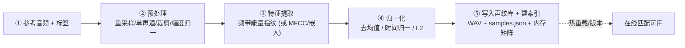
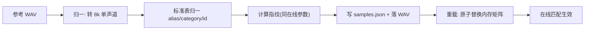
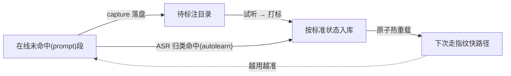

# 声纹库建设 — 详细技术文档

> 本文给出**声纹库(= 音频指纹库)从 0 到可用**的端到端建设规范:参考音频与标签准备、预处理、特征/嵌入提取、归一化、写入与建索引,以及**后期维护与运营**。
> 主力算法:**对数频带能量指纹 + 余弦最近邻 + 阈值分级**(ASR 兜底);当前规模:数百条,索引用内存暴力余弦(`LinearIndex`),涨到万级再切 HNSW。
> 配套:[`声纹库与声纹匹配-算法实现原理`](./声纹库与声纹匹配-算法实现原理.md)、[`服务端建设方案-Java版`](./回铃音检测平台-服务端建设方案-Java版.md)(§8 库管理 / §12 可扩展抽象)。

> **术语**:"声纹"取广义,指"把一段提示音压成可比较的特征向量(指纹)"——**音频音色/时频结构匹配,非说话人声纹识别**。

---

## 0. 总览:入库流水线



**贯穿原则**:**入库与在线查询必须使用完全相同的预处理 + 特征 + 归一化参数**,否则指纹不可比、匹配失效。本文所有参数即"对拍基准",三语言(Java/Rust/Python)实现须对齐。

---

## 1. 参考音频 + 标签 的准备要求

### 1.1 音频要求

| 项 | 要求 | 说明 |
|---|---|---|
| 来源 | **真实外呼录制的早期媒体** | 优先服务端回流(未命中段)与 mod 侧 `recordpath` 录音,贴近线上信道 |
| 编码 | **WAV / PCM,8kHz,16bit,单声道** | 参考样本**禁用有损**(mp3/opus),避免损伤指纹 |
| 内容单一 | **一条样本只含一种提示音** | 不混入回铃、彩铃、真人、多段提示 |
| 截取 | 从语音起点到一个**完整语义单元**结束 | 去掉首尾长静音;典型 1–5s;含提示音的一个完整循环/一句话 |
| 质量 | 清晰、无明显叠加噪声/音乐 | 信噪比低或叠彩铃的样本不入库(或先降噪评估) |
| 多变体 | 同一状态收**多条变体** | 多运营商 / 多地区 / 多措辞 / 不同 TTS 嗓音,**覆盖度=准确率** |

### 1.2 标签要求(对齐标准状态表)

标签必须对齐**号码状态标准表(id 2-20,单一来源 `states.py`)**:

| 字段 | 必填 | 说明 |
|---|---|---|
| `name` | 是 | **样本唯一标识**,建议命名 `状态_运营商_地区`,如 `konghao_yidong_gd` |
| `category` | 是* | 中文状态类别(空号/关机…) |
| `alias` | 是* | 英文别名(does not exist / power off…) |
| `id` | 自动 | 入库时按标准表归一回填(2-20) |
| 元数据(建议) | 否 | 运营商、地区、采集时间、来源(capture/录音)、采集人 |

\* `category` / `alias **给其一即可**,入库时 `normalize()` 自动补全另一并写 `id`;**`strict` 模式拒绝非标准状态**,防止标签发散。

### 1.3 数量与覆盖建议

- **优先覆盖高频状态**:关机 / 空号 / 停机 / 通话中(覆盖到位可 >99%)。
- 每状态**多条变体**;易混/措辞多样的(语音信箱/秘书/稍后再拨)需更多样本 + ASR 兜底。
- 当前数百条:先把高频状态各运营商变体补齐,再逐步扩边角状态。

### 1.4 合规

- 录音**脱敏**:去除主被叫号码等隐私;按合规留存与访问控制。
- 用开源 ASR/本地处理可做到**数据不出域**。

---

## 2. 预处理:采用哪些手段和技术

目标:把不同来源音频统一成"可比的干净短段"。**入库与在线一致**是铁律。

| 步骤 | 技术 | 说明 / 默认 |
|---|---|---|
| 解码 | WAV 解析 | 读为 int16 PCM |
| **重采样** | 线性/多相重采样到 **8kHz** | 库内统一采样率(`library.py` 的 `resample_linear`) |
| **单声道化** | 多路混合或取一路 | 统一单声道 |
| 去直流(DC) | 减均值 | 去录音直流偏置 |
| 预加重(可选) | `y[n]-0.97·y[n-1]` | 提升高频,视效果启用 |
| **幅度/RMS 归一** | 按 RMS 或峰值归一 | 增益无关的第一道(与特征级去均值互补) |
| **端点裁剪(VAD)** | 能量/神经 VAD 去首尾静音 | 保留语义段;限制最大时长(如 ≤8s) |
| 降噪(可选,谨慎) | 谱减 / 维纳滤波 | **慎用**:过度降噪会改变频谱结构,破坏库内一致性;若用,入库与在线都要用 |

> 原则:**少即是好**。预处理越复杂,越要保证入库/在线严格一致,否则引入"训练-推理偏移"导致漏判。

---

## 3. 特征/嵌入提取:采用哪些手段和技术

### 3.1 主力:对数频带能量指纹(本项目选型)

```
段 PCM → 分帧加窗 → FFT 功率谱 → 电话频带对数频带能量聚合 → log 压缩 → 时间平滑
```

**对拍基准参数(三语言必须一致)**

| 参数 | 默认值 | 说明 |
|---|---|---|
| 采样率 | 8000 Hz | 电话域 |
| 窗长 | 32ms | 加**汉宁窗** |
| 帧移 | 16ms | 50% 重叠 |
| 频带范围 | **200–3400Hz** | 电话有效频带 |
| 频带数 | **16**(对数刻度 `logspace`) | 梅尔风格的对数频带聚合 |
| 能量压缩 | `log1p` | 压缩动态范围 |
| 时间平滑 | 3 帧滑动平均 | 抑制加性噪声 |

### 3.2 备选与升级路径

| 方案 | 何时用 | 说明 |
|---|---|---|
| **MFCC**(频带能量 + DCT) | 想要去相关特征 | 同族,效果接近;本项目默认**不做 DCT** |
| **深度嵌入**(ECAPA/WavLM/CLAP) | 需强泛化/少样本/大库 | 升级路径,经 ONNX 跨语言;算力大,放兜底或离线 |

> 通过平台 §12 的 `FeatureExtractor` 抽象切换,**主链路与协议不变**。

---

## 4. 归一化:采用哪些手段和技术

把"频带能量序列"变成"增益无关、时长无关、可余弦比较"的定长向量:

| 步骤 | 技术 | 意图 |
|---|---|---|
| **逐帧去均值** | 每帧减去其频带均值 | **增益/音量无关**(整体响度变化被抵消) |
| **时间轴归一** | 线性重采样到**固定 32 帧** | **不同时长可比**(变长→定长),容忍语速差异 |
| 展平 | `16 × 32 → 512` 维向量 | 合并时频结构为单向量 |
| **L2 归一** | 向量除以其模长 | 使**余弦相似度 = 点积**,数值稳定 |
| (嵌入路径) | 长度归一 / PLDA | 深度嵌入的标准后处理 |

最终得到**定长(如 512 维)L2 归一向量**,即该样本的"声纹"。匹配时查询段走同样流程,与库向量求点积。

---

## 5. 写入声纹库 + 建索引:存储格式与索引机制

### 5.1 存储格式(当前数百条)

**目录 + WAV + JSON**(原始音频是真理之源,向量/索引可重建):

```
samples/
├── samples.json           # 索引/元数据(单一来源)
├── konghao_yidong_gd.wav  # 8k/16bit 单声道
├── guanji_yidong.wav
└── ...
```

`samples.json` 字段:

```json
[
  {
    "file": "konghao_yidong_gd.wav",
    "name": "konghao_yidong_gd",
    "alias": "does not exist",
    "category": "空号",
    "id": 3,
    "operator": "yidong",
    "region": "guangdong",
    "source": "capture",
    "added_at": "2026-06-18"
  }
]
```

| 字段 | 说明 |
|---|---|
| `file` | 样本 WAV 文件名 |
| `name` | 唯一标识 |
| `category`/`alias`/`id` | 标准状态(归一回填) |
| `operator`/`region`/`source`/`added_at` | 运营建议元数据 |

**向量缓存(可选)**:数百条启动重算 <1s,可不持久化;如需提速,缓存为**语言中立格式** `.parquet`/`.npy`(float32、L2 归一),便于三语言读取。**不要用 pickle**(偏 Python、跨语言差)。

### 5.2 索引机制(按规模)

| 规模 | 索引 | 机制 |
|---|---|---|
| **数百~数千(当前)** | **`LinearIndex`(内存矩阵暴力余弦)** | 库指纹堆成 `N×512` 矩阵,查询一次矩阵乘取最近邻;**精确、亚毫秒、零依赖** |
| 万~百万 | HNSW(`hnswlib`/`hnsw_rs`/Lucene/pgvector) | 近似最近邻,低延迟 |
| 千万~亿 | IVF-PQ / DiskANN(Milvus/Vespa) | 量化 + 磁盘扩展 |

> 当前**坚决用暴力余弦**:几百条上 ANN 无收益且有召回损失。升级触发:样本 ≈ 1 万条以上,按平台 §12 换 `Index` 实现,主链路不变。

### 5.3 入库流程与一致性



- 入库统一**转 8k 单声道 + 标准表归一**(同名覆盖),保证库内一致与跨节点可比。
- **指纹计算必须与在线查询同参数**(§3 对拍基准)。

### 5.4 版本与热重载

- **版本化**:`库版本 = 音频集 + 向量 + 索引` 一起打版本号,存 **git(数百条体积小,最简)** 或对象存储;集群各节点/进程拉同一版本。
- **灰度发布**:按节点分批切版本,避免结果跳变;库版本可随结果上报便于追溯。
- **热重载**:新库加载为独立对象,**原子替换引用**,进行中的匹配用旧引用跑完,不停服。

---

## 6. 后期维护与运营注意事项

声纹库是**持续运营的资产**,不是一次性交付。准确率随运营提升。

### 6.1 采集—打标—入库闭环



- 持续从线上**回流未命中段**;人工试听打标入库;ASR 归类命中可自动补库。
- **优先补高频与易漏状态**;定期清空积压待标注。

### 6.2 质量治理

- **去重**:近重复样本(同运营商同录音)只保留代表,避免库膨胀与偏置。
- **纠错**:定期审阅误标/错标;借命中分布发现异常样本。
- **去噪样本剔除**:信噪比差、叠彩铃/真人的样本不应入库(它们是误判源)。
- **标签一致性**:统一引用 `states.py`,入库走 `strict`,杜绝标签发散。

### 6.3 准确率监控与回归

- **带标注测试集**:维护固定测试集,定期跑 **precision/recall(分状态)**,防止"加样本反而变差"的回归。
- **线上指标**:各状态命中率、`ACCURACY` 占比、误挂率、未命中(prompt)率;异常波动告警(对应服务端 §11.6)。
- **双轨上线**:新库/新阈值先"**只打标不挂机**",抽样校验 precision 达标再开 `autohangup`。

### 6.4 阈值与易混状态

- 调 `accuracy`/`inaccuracy` 平衡"准 vs 全";仅 `ACCURACY` 触发动作。
- **多段投票**:提示音循环播放,连续 2 段一致再采信,降误判。
- 易混话术(如"通话中,请稍后再拨")给"稍后再拨"**降优先级**(放归类末位)。

### 6.5 变更管理

- **特征参数变更 = 全库重算 + 三语言对拍**:任何窗长/频带/帧数等改动都会使旧指纹失效,必须重算整库并在 Java/Rust/Python 三端对拍 `score` 一致后再发布。
- **新增状态**:先在 `states.py` 增条目(id/category/alias/keywords)→ 采样入库 → 更新关键词归类 → 回归测试。
- **版本回滚**:保留近若干版本,出问题可快速回退。

### 6.6 规模与升级触发

- 监控样本量与单段匹配延迟;接近预算或样本 ≈ 1 万条以上时,按平台 §12 从 `LinearIndex` 切 `HnswIndex`(主链路不变);十万级再上 pgvector/Milvus。

### 6.7 合规与安全

- 录音/回流样本脱敏、加密存储、访问审计;按保留期清理。
- 库与索引快照纳入备份与灾备。

---

## 附:相关文档索引

| 文档 | 内容 |
|---|---|
| [`docs/声纹库与声纹匹配-算法实现原理.md`](./声纹库与声纹匹配-算法实现原理.md) | 算法原理、主流/前沿方案、关键数据结构 |
| [`docs/回铃音检测平台-服务端建设方案-Java版.md`](./回铃音检测平台-服务端建设方案-Java版.md) | 平台落地(§8 库管理 / §12 可扩展抽象 + ANN) |
| [`docs/ACCURACY.md`](./ACCURACY.md) | 提升准确率的工程手段 |
| [`docs/回铃音检测-技术方案沟通.md`](./回铃音检测-技术方案沟通.md) | 总体技术方案 |
